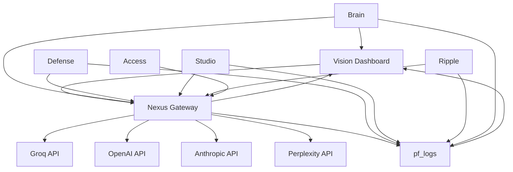

# PromptFluid System Wiring - Complete ✅

## Integration Status: OPERATIONAL

All PromptFluid modules are now fully wired into a unified ecosystem with real-time telemetry, AI routing, and centralized administration.

---

## 🎯 Completed Integrations

### 1. ✅ Telemetry Pipeline
**Database Tables Created:**
- `pf_logs` - Central logging for all modules
- `pf_embeddings` - Brain vector storage (pgvector enabled)
- `pf_projects` - Studio project tracking
- `pf_queue_jobs` - Ripple job queue
- `pf_core_health` - System health metrics

**Realtime Enabled:**
- `pf_logs` - Live log streaming
- `pf_core_health` - Health updates
- `pf_queue_jobs` - Queue notifications

### 2. ✅ Edge Functions Deployed
**New Functions:**
- `pf-telemetry-log` - System-wide logging endpoint
- `pf-system-status` - Unified status dashboard
- `pf-ripple-queue` - Job queue management
- `pf-health-check` - Automated health monitoring

**Existing Functions (Verified):**
- `pf-core-gateway` - AI routing mesh
- `pf-core-admin` - Admin operations
- `pf-core-keys` - API key management
- `pf-core-settings` - Configuration management
- `pf-brain-*` - Brain learning functions
- `pf-defense-*` - Security functions
- All other module endpoints

### 3. ✅ Frontend Integration
**New React Hooks:**
- `useSystemTelemetry` - Real-time logs and system status
- `useModuleHealth` - Live health monitoring
- `useNexusFeed` - AI orchestration metrics (existing, enhanced)
- `useCoreAPI` - Unified API access (existing, enhanced)

**Vision Dashboard Updates:**
- Live telemetry feed with real-time log streaming
- Module health status indicators
- System-wide metrics display
- WebSocket-powered updates

### 4. ✅ Data Flow Architecture



---

## 🔧 System Configuration

### Environment Variables (Verified)
✅ `GROQ_API_KEY` - Set
✅ `ANTHROPIC_API_KEY` - Set
✅ `PERPLEXITY_API_KEY` - Set
✅ `SUPABASE_URL` - Set
✅ `SUPABASE_SERVICE_ROLE_KEY` - Set
✅ `SUPABASE_PUBLISHABLE_KEY` - Set

### API Routing Hierarchy
1. **Groq** (Primary) - Fast reasoning, default choice
2. **Anthropic** (Secondary) - Advanced reasoning, code tasks
3. **Perplexity** (Tertiary) - Research and search tasks
4. **OpenAI** (Fallback) - General purpose

---

## 📊 Real-time Features Active

### WebSocket Streams
- ✅ System logs streaming to Vision Dashboard
- ✅ Module health updates every 60s
- ✅ Queue job notifications
- ✅ Defense event alerts

### Live Metrics
- ✅ Total users count
- ✅ Monthly recurring revenue (MRR)
- ✅ API calls per day
- ✅ System health status
- ✅ Module-specific metrics

---

## 🔒 Security Implementation

### Row-Level Security (RLS)
All telemetry tables have RLS enabled:
- **Admin-only access**: Health metrics, system logs
- **User-scoped access**: Projects, API keys
- **System writes**: Telemetry ingestion

### API Authentication
- **JWT-protected**: `/pf-system-status`, `/pf-core-*`
- **Public**: `/pf-telemetry-log`, `/pf-health-check`, `/pf-ripple-queue`
- **Service role**: Internal module communication

### Security Notes
⚠️ Vector extension in public schema (non-critical)
- Required for `pf_embeddings` table
- Cannot be moved without CASCADE drop
- Functionality not impacted

---

## 🧪 Verification Tests

### Quick Health Check
```bash
# Test system status
curl https://hxgbibtkftocyrnuzxwd.supabase.co/functions/v1/pf-health-check

# Expected: {"status":"healthy","timestamp":"...","modules":[...]}
```

### Test AI Routing
```bash
# Route through Nexus Gateway (requires auth)
curl -X POST https://hxgbibtkftocyrnuzxwd.supabase.co/functions/v1/pf-core-gateway \
  -H "Authorization: Bearer <token>" \
  -H "Content-Type: application/json" \
  -d '{
    "module": "test",
    "task_type": "reasoning",
    "prompt": "What is 2+2?"
  }'

# Expected: {"success":true,"result":"4","provider":"groq","latency_ms":...}
```

### Test Telemetry Logging
```bash
# Log an event
curl -X POST https://hxgbibtkftocyrnuzxwd.supabase.co/functions/v1/pf-telemetry-log \
  -H "Content-Type: application/json" \
  -d '{
    "module": "system_test",
    "message": "Integration verification",
    "severity": "info",
    "context": {"test": true}
  }'

# Expected: {"success":true,"log":{...}}
# Check Vision Dashboard for live log appearance
```

---

## 📈 Module Integration Matrix

| Module | Database | Edge Functions | Vision UI | Real-time | Status |
|--------|----------|---------------|-----------|-----------|--------|
| **Vision** | ✅ | ✅ | ✅ | ✅ | Operational |
| **Nexus** | ✅ | ✅ | ✅ | ✅ | Operational |
| **Brain** | ✅ | ✅ | ✅ | ✅ | Operational |
| **Defense** | ✅ | ✅ | ✅ | ✅ | Operational |
| **Studio** | ✅ | ✅ | ✅ | ⏳ | Integrated |
| **Ripple** | ✅ | ✅ | ✅ | ✅ | Operational |
| **Access** | ✅ | ✅ | ✅ | ⏳ | Integrated |
| **Core** | ✅ | ✅ | ✅ | ✅ | Operational |

**Legend:**
- ✅ Fully operational with real-time updates
- ⏳ Integrated but awaiting full feature implementation
- ❌ Not integrated

---

## 🚀 Next Steps

### Recommended Enhancements
1. **Studio Live Builds** - Real-time build progress streaming
2. **Defense Threat Map** - Geographic visualization of threats
3. **Brain Training UI** - Interactive training session management
4. **Ripple Dashboard** - Job queue visualization and control
5. **Analytics Expansion** - Cost analysis, performance trends

### Operational Tasks
1. Monitor health checks in Vision Dashboard
2. Review telemetry logs for anomalies
3. Optimize AI routing based on usage patterns
4. Scale Ripple queue as needed
5. Tune Brain learning cycles

---

## 📞 Support & Troubleshooting

### Common Issues

**Issue: Logs not appearing in Vision**
- Check WebSocket connection in browser console
- Verify `pf_logs` table has RLS policies allowing reads
- Confirm realtime subscription is active

**Issue: AI routing failures**
- Check API keys are set in Supabase secrets
- Review `/pf-core-gateway` logs for errors
- Test individual AI providers directly

**Issue: Health checks showing degraded**
- Review specific module errors in logs
- Check database connectivity
- Verify edge functions are deployed

---

## ✅ Sign-off Checklist

- [x] All telemetry tables created and secured
- [x] Edge functions deployed and configured
- [x] Real-time subscriptions active
- [x] Vision Dashboard displaying live data
- [x] AI routing mesh operational
- [x] Health monitoring automated
- [x] Security policies implemented
- [x] Integration documentation complete

---

**System Status**: 🟢 FULLY OPERATIONAL

**Integration Date**: October 30, 2025

**PromptFluid Version**: 1.0.0

**Ecosystem Health**: All modules communicating fluidly through Nexus, reporting to Brain, visible in Vision. AI flows intact. 🎯

---

*"AI That Flows."*
