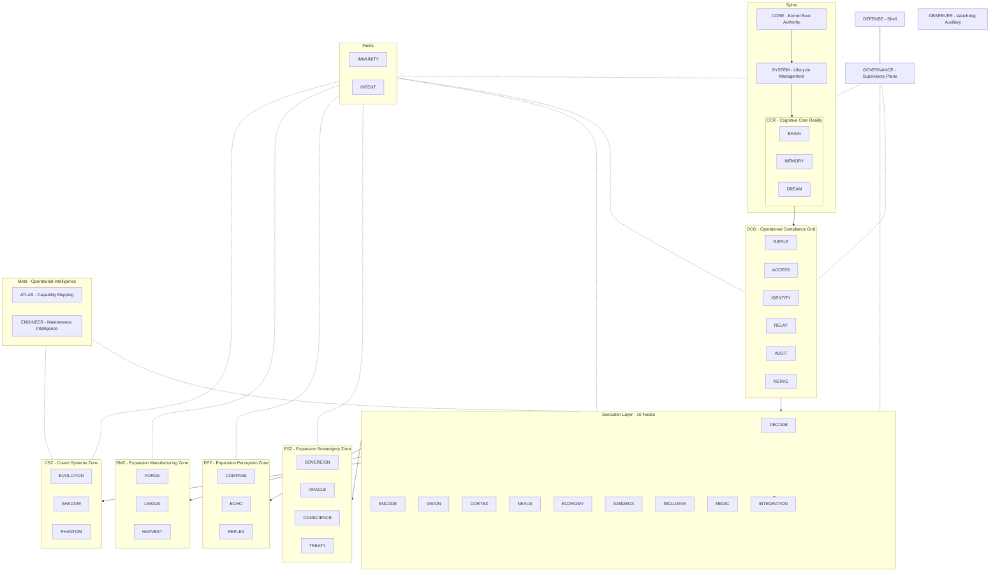

# Master Architecture Specification

## 1. Purpose

This document defines the complete architectural specification for the CMPSBL substrate. It serves as the canonical reference for all structural decisions, component responsibilities, and execution boundaries.

## 2. System Thesis

The CMPSBL substrate is a field-based cognitive kernel that operates as a self-governing AI orchestration layer. It organizes **40 primitives** across a **4-category** Organs / Layers / Engines / Agents taxonomy, providing weighted health monitoring, circuit-breaker isolation, and deterministic governance. The system is designed for autonomous operation under human oversight, with every action subject to legitimacy checks, audit logging, and rollback capability.

The substrate is not an application — it is infrastructure. It provides the execution surface on which cognitive agents, memory systems, and compliance grids operate.

## 3. Architectural Principles

- **Dependency-ordered boot**: Primitives initialize in strict topological order.
- **Weighted integrity**: System health is a deterministic weighted sum across all 40 primitives (Σ = 1.000).
- **Circuit-breaker isolation**: Every primitive has independent failure tracking; open breakers force health to 0.
- **Field permeation**: Fields (IMMUNITY, INTENT) cross-cut all layers rather than stacking.
- **GOVERNANCE supervision**: Every mutating action requires legitimacy approval.
- **DEFENSE terminal enforcement**: The outermost boundary is non-negotiable.
- **NEXUS routing authority**: All external requests route through NEXUS.
- **Immutable audit trail**: AUDIT provides tamper-evident logging for all security-relevant events.
- **BYOK sovereignty**: Operators own their keys, data, and infrastructure.
- **Zone shielding**: Expansion modules are grouped into shielded zones (ESZ, EPZ, EMZ) with independent circuit breakers.
- **Disaster recovery**: One-click full backup captures entire system state for portable restoration.

## 4. High-Level Topology Diagram



## 5. Sector Definitions

| Sector | Nodes | Weight | Responsibility Boundary |
|--------|-------|--------|------------------------|
| Spine: CORE | CORE | 0.110 | Kernel boot, matrix ownership, integrity calculation |
| Spine: SYSTEM | SYSTEM | 0.035 | Lifecycle, configuration, environment management |
| Spine: CCR | BRAIN, MEMORY, DREAM | 0.115 | Reasoning, persistent state, synthesis |
| Grid: OCG | RIPPLE, ACCESS, IDENTITY, RELAY, AUDIT, NERVE | 0.140 | Boundary enforcement, compliance, event routing, signaling |
| Execution | 10 modules | 0.240 | Public-facing cognitive capabilities |
| ESZ | SOVEREIGN, ORACLE, CONSCIENCE, TREATY | 0.075 | Governance expansion, compliance, ethics |
| EPZ | COMPASS, ECHO, REFLEX | 0.055 | Perception, simulation, edge computing |
| EMZ | FORGE, LINGUA, HARVEST | 0.045 | Manufacturing, translation, data |
| CSZ | EVOLUTION, SHADOW, PHANTOM | 0.045 | Self-improvement, shadow testing, stealth |
| Fields | IMMUNITY, INTENT | 0.040 | Cross-cutting transformation fabric |
| Meta | ATLAS, ENGINEER | 0.040 | Capability mapping, maintenance intelligence |
| Plane | GOVERNANCE | 0.030 | Supervisory legitimacy checks |
| Shell | DEFENSE | 0.030 | Terminal containment boundary |
| Auxiliary | OBSERVER | — | Watchdog monitoring, telemetry aggregation, anomaly detection |

**Total: 40 Matrix Nodes + 1 Auxiliary (OBSERVER) across 12 Sectors, Σ(weight) = 1.000**

## 6. Component Registry

| Component | Sector | Responsibility | Dependencies |
|-----------|--------|---------------|-------------|
| CORE | Spine | Boot sequencing, integrity scoring | None (root) |
| SYSTEM | Spine | Configuration, lifecycle hooks | CORE |
| BRAIN | CCR | Reasoning, pattern recognition | SYSTEM |
| MEMORY | CCR | State persistence, retrieval, tier enforcement | SYSTEM |
| DREAM | CCR | Heuristic generation, synthesis | BRAIN, MEMORY |
| RIPPLE | OCG | Event propagation, cascade detection | CORE |
| ACCESS | OCG | Auth, billing, API key management | CORE |
| IDENTITY | OCG | Entity resolution, session management | CORE |
| RELAY | OCG | Cross-module messaging, webhooks | CORE |
| AUDIT | OCG | Immutable logging, tamper detection | CORE |
| NERVE | OCG | Inter-node signaling, consensus repair | CORE, RIPPLE |
| DECODE | Execution | Natural language understanding, intent parsing | CORE |
| ENCODE | Execution | Code generation, surgical patching | CORE, DECODE |
| VISION | Execution | Telemetry, observability, anomaly detection | CORE |
| CORTEX | Execution | Pipeline composition, cognitive orchestration | CORE |
| NEXUS | Execution | AI provider routing, fleet intelligence | CORE |
| ECONOMY | Execution | Cost tracking, budget governance | CORE |
| SANDBOX | Execution | Isolated execution, speculative runs | CORE |
| INCLUSIVE | Execution | WCAG compliance, accessibility scanning | CORE |
| MEDIC | Execution | Autonomous diagnostics, predictive failure | CORE, VISION |
| INTEGRATION | Execution | External connectivity, adapters (boots last) | CORE |
| SOVEREIGN | ESZ | Data sovereignty, jurisdictional compliance | CORE, DEFENSE, ACCESS |
| ORACLE | ESZ | Predictive modeling, Bayesian inference | CORE, BRAIN, VISION |
| CONSCIENCE | ESZ | Ethical assessment, bias detection | CORE, DEFENSE |
| TREATY | ESZ | Contract negotiation, SLA enforcement | CORE, ACCESS |
| COMPASS | EPZ | Geospatial analysis, navigation intelligence | CORE, VISION, BRAIN |
| ECHO | EPZ | Digital twin simulation, scenario replay | CORE, MEMORY |
| REFLEX | EPZ | Edge computing orchestration, low-latency loops | CORE, NEXUS, VISION |
| FORGE | EMZ | Artifact synthesis, template generation | CORE, ENCODE |
| LINGUA | EMZ | Translation, localization, multi-language | CORE, DECODE, NEXUS |
| HARVEST | EMZ | Data acquisition, ETL pipelines | CORE, MEMORY, ECONOMY |
| EVOLUTION | CSZ | Version management, shadow runs, canary deployment | Permeates all |
| SHADOW | CSZ | Isolated shadow execution, divergence scoring | CORE, EVOLUTION |
| PHANTOM | CSZ | Privacy protection, PII masking, decoy operations | CORE, DEFENSE, IDENTITY |
| IMMUNITY | Field | Threat adaptation, cascade breaking, anomaly signatures | Permeates all |
| INTENT | Field | Purpose alignment, goal decomposition | Permeates all |
| ATLAS | Meta | Capability mapping, topology awareness, governance hub | CORE, VISION |
| ENGINEER | Meta | Engine health scanning, maintenance proposals, CLM dispatch | CORE, BRAIN |
| GOVERNANCE | Plane | Legitimacy supervision, veto authority | Supervises all |
| DEFENSE | Shell | Boundary enforcement, threat response | Encloses all |

## 7. Zone Shielding Architecture

Expansion modules are organized into **shielded zones** — each zone has its own circuit breaker boundary and can be independently degraded or isolated without affecting core substrate operations.

### ESZ — Expansion Sovereignty Zone
Governs compliance, ethics, and contractual obligations. Contains modules that enforce regulatory and ethical boundaries. If ESZ degrades, core substrate continues operating under baseline governance rules.

### EPZ — Expansion Perception Zone
Handles predictive analysis, simulation, and edge-tier computation. These modules extend the substrate's awareness of future states and external environments. EPZ degradation reduces foresight but preserves core operations.

### EMZ — Expansion Manufacturing Zone
Manages artifact production, translation, and data ingestion. These modules extend the substrate's ability to manufacture outputs and process inputs. EMZ degradation limits production capacity but preserves cognitive function.

### CSZ — Covert Systems Zone
Houses evolution, shadow testing, and phantom operations. CSZ is zone-shielded from production — failures within it cannot propagate to live systems.

## 8. Execution Lifecycle

### Boot Sequence
```
CORE → SYSTEM → CCR (BRAIN, MEMORY, DREAM) → OCG (RIPPLE, ACCESS, IDENTITY, RELAY, AUDIT, NERVE)
  → Execution (DECODE..INTEGRATION)
  → ESZ (SOVEREIGN, ORACLE, CONSCIENCE, TREATY)
  → EPZ (COMPASS, ECHO, REFLEX)
  → EMZ (FORGE, LINGUA, HARVEST)
  → CSZ (EVOLUTION, SHADOW, PHANTOM)
  → Fields (IMMUNITY, INTENT) permeate
  → Meta (ATLAS, ENGINEER) observe
  → Plane (GOVERNANCE) supervises
  → Shell (DEFENSE) encloses
```

### Request Flow
1. External request arrives at DEFENSE (Shell).
2. DEFENSE performs threat assessment (IP reputation, behavioral analysis, payload inspection).
3. Approved requests route to NEXUS for provider/model selection.
4. NEXUS delegates to appropriate Execution primitive (DECODE, ENCODE, CORTEX, etc.).
5. Execution primitive processes request, consulting CCR (BRAIN, MEMORY, DREAM) as needed.
6. OCG modules enforce compliance boundaries throughout execution.
7. Expansion zones (ESZ, EPZ, EMZ) provide specialized capabilities when invoked.
8. Response returns through NEXUS → DEFENSE → Client.

### State Transitions
- **Boot** → CORE initializes → layers cascade → all 40 primitives online.
- **Steady State** → Request processing, health monitoring, periodic persistence.
- **Degraded** → Circuit breaker open on one or more primitives; system continues with reduced capability.
- **Zone Isolated** → Entire expansion zone (ESZ/EPZ/EMZ/CSZ) degraded; core operations continue.
- **Recovery** → Breaker reset, state reconciliation, audit verification.

## 9. Isolation Boundaries

- Each of the 40 primitives operates within its own circuit-breaker boundary.
- Expansion zones (ESZ, EPZ, EMZ, CSZ) provide zone-level isolation — an entire zone can degrade gracefully.
- Module failure does not propagate unless RIPPLE detects a cascade chain.
- SANDBOX provides execution isolation for untrusted code.
- DEFENSE enforces the outermost trust boundary.
- Row-Level Security enforces per-user data isolation at the database layer.

## 10. Failure Domains

| Domain | Scope | Impact | Recovery |
|--------|-------|--------|----------|
| Primitive Failure | Single primitive | Degraded capability | Circuit breaker reset |
| Category Failure | ESZ/EPZ/EMZ/CSZ (3-4 primitives) | Zone capabilities offline | Zone-level recovery |
| Cascade Chain | Multiple primitives | Significant degradation | Origin arrest, staged recovery |
| Persistence Failure | Storage layer | Runtime continues, durability lost | WAL replay, snapshot restore |
| Governance Conflict | Decision layer | Action blocked | Evaluation, manual override |
| CORE Failure | System-critical | Full system halt | Restart from boot sequence |
| Full Infrastructure Loss | All layers | Complete outage | One-click disaster recovery backup restore |

## 11. Control Planes

| Control Plane | Owner | Scope |
|--------------|-------|-------|
| Boot Control | CORE | Initialization sequence |
| Lifecycle Control | SYSTEM | Configuration, environment |
| Routing Control | NEXUS | API dispatch, provider selection |
| Compliance Control | OCG | Boundary enforcement |
| Governance Control | GOVERNANCE | Action legitimacy |
| Security Control | DEFENSE | Threat response |
| Evolution Control | EVOLUTION | Version management |
| Sovereignty Control | ESZ | Jurisdictional compliance |
| Perception Control | EPZ | Predictive awareness |
| Manufacturing Control | EMZ | Artifact production |
| Topology Control | ATLAS | Capability mapping, node discovery |
| Maintenance Control | ENGINEER | Engine health, proposal generation |

## 12. Dependency Graph

```
CORE (root)
├── SYSTEM
│   ├── BRAIN (CCR)
│   ├── MEMORY (CCR)
│   └── DREAM (CCR)
├── RIPPLE (OCG)
├── ACCESS (OCG)
├── IDENTITY (OCG)
├── RELAY (OCG)
├── AUDIT (OCG)
├── NERVE (OCG) → RIPPLE
├── DECODE (Execution)
├── ENCODE (Execution) → DECODE
├── VISION (Execution)
├── CORTEX (Execution)
├── NEXUS (Execution)
├── ECONOMY (Execution)
├── SANDBOX (Execution)
├── INCLUSIVE (Execution)
├── MEDIC (Execution) → VISION
├── INTEGRATION (Execution, boots last)
├── SOVEREIGN (ESZ) → DEFENSE, ACCESS
├── ORACLE (ESZ) → BRAIN, VISION
├── CONSCIENCE (ESZ) → DEFENSE
├── TREATY (ESZ) → ACCESS
├── COMPASS (EPZ) → VISION, BRAIN
├── ECHO (EPZ) → MEMORY
├── REFLEX (EPZ) → NEXUS, VISION
├── FORGE (EMZ) → ENCODE
├── LINGUA (EMZ) → DECODE, NEXUS
├── HARVEST (EMZ) → MEMORY, ECONOMY
├── EVOLUTION (CSZ) — permeates all
├── SHADOW (CSZ) → EVOLUTION
├── PHANTOM (CSZ) → DEFENSE, IDENTITY
├── ATLAS (Meta) → VISION
├── ENGINEER (Meta) → BRAIN
Fields (IMMUNITY, INTENT) — permeate all sectors
GOVERNANCE — supervises all sectors
DEFENSE — encloses all sectors
```

## 13. Versioning Compatibility Model

- Major versions (epochs) may introduce breaking changes.
- Minor versions maintain backward compatibility within the epoch.
- Patch versions contain fixes only — no behavioral changes.
- All version transitions require EVOLUTION shadow runs before promotion.
- Deprecated capabilities remain functional for one full minor version after deprecation notice.

## 14. Non-Goals

- The substrate is not an application framework.
- The substrate does not provide a general-purpose database.
- The substrate does not manage end-user authentication directly (delegated to ACCESS).
- The substrate does not include AI model weights or training data.
- The substrate does not guarantee real-time latency below infrastructure limits.

## 15. Revision History

| Date | Author | Change |
|------|--------|--------|
| 2026-03-22 | System | v14.2.0 — Added OBSERVER auxiliary node, expanded all node capability surfaces with standardized lifecycle (init/health/resilience/hardening/runCLM/upgradeEngine), updated node docs |
| 2026-03-12 | System | v14.1.0 MINDGAMES — Updated to 40-primitive/4-category topology (added ATLAS, ENGINEER as Meta sector), disaster recovery backup, updated weights |
| 2026-03-03 | System | v13.1.0 — Fixed NERVE→OCG, PHANTOM→CSZ, EVOLUTION→CSZ, added CSZ sector, 38/12 topology validated |
| 2026-03-03 | System | v13.1.0 — AutoBlog quality pipeline, adaptive publish governor, semantic drift, confidence governance |
| 2026-03-03 | System | Expanded to 38-node architecture with ESZ/EPZ/EMZ/CSZ zone shielding |
| 2026-03-01 | System | Initial canonical specification (24 primitives) |

## 16. Related Documents

- [Governance & Autonomy Doctrine](../02-governance/governance-autonomy-doctrine.md)
- [Security Architecture](../03-security/security-architecture.md)
- [Data & Memory Model](../04-data-memory/data-and-memory-model.md)
- [Evolution & Versioning Framework](../05-evolution-versioning/evolution-and-versioning-framework.md)
- [Observability & Telemetry Handbook](../06-observability/observability-telemetry-handbook.md)
- [Engineering Proof & Scale](../14-engineering-proof/engineering-proof-and-scale.md)
- [Internal: Topology Topology & Module Registry Primitive Registry](../internal/01-topology-and-module-registry.md)
- [Internal: Ironclad Hardening Fabric](../internal/30-ironclad-hardening-fabric.md)

---

© 2025–2026 PromptFluid®. All rights reserved.
