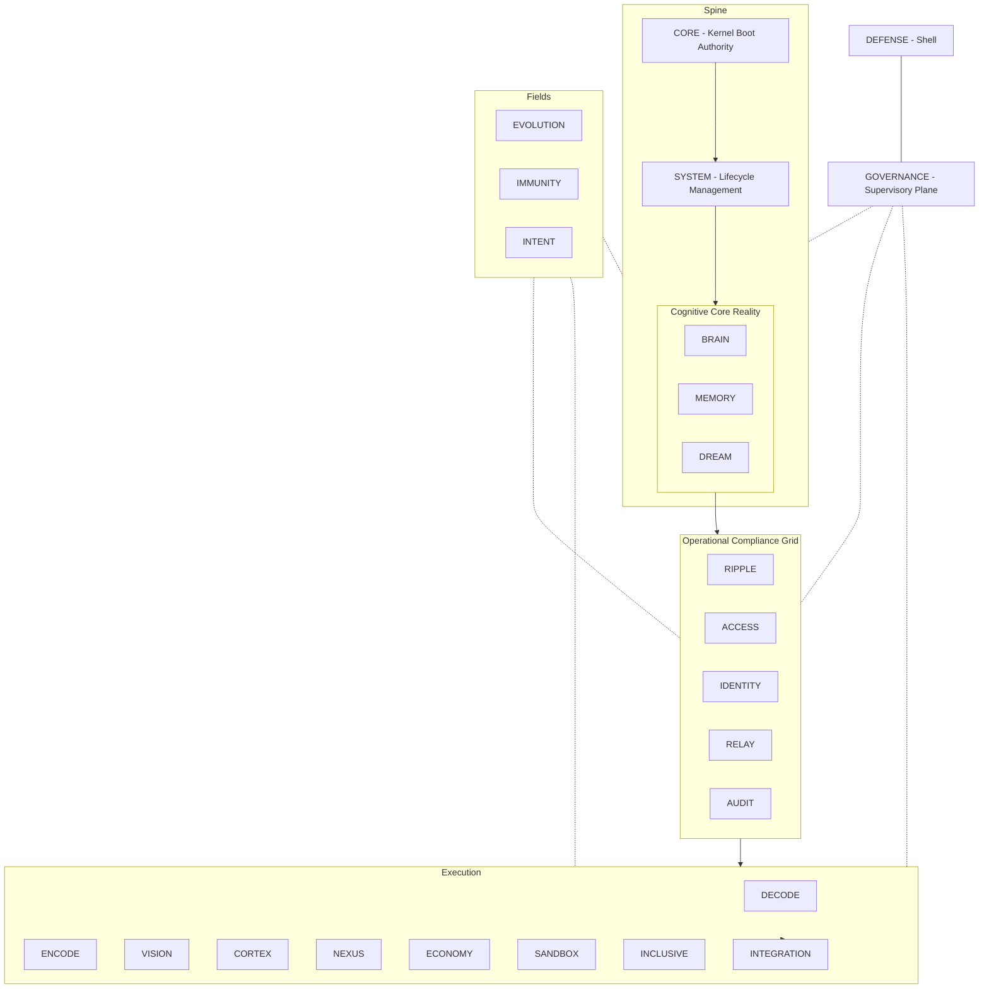

# Master Architecture Specification

## 1. Purpose

This document defines the complete architectural specification for the CMPSBL substrate. It serves as the canonical reference for all structural decisions, component responsibilities, and execution boundaries.

## 2. System Thesis

The CMPSBL substrate is a field-based cognitive kernel that operates as a self-governing AI orchestration layer. It organizes 24 modules across a Spine / Grid / Field / Plane / Shell topology, providing weighted health monitoring, circuit-breaker isolation, and deterministic governance. The system is designed for autonomous operation under human oversight, with every action subject to legitimacy checks, audit logging, and rollback capability.

The substrate is not an application — it is infrastructure. It provides the execution surface on which cognitive agents, memory systems, and compliance grids operate.

## 3. Architectural Principles

- **Dependency-ordered boot**: Modules initialize in strict topological order.
- **Weighted integrity**: System health is a deterministic weighted sum across all 24 nodes (Σ = 1.000).
- **Circuit-breaker isolation**: Every module has independent failure tracking; open breakers force health to 0.
- **Field permeation**: Fields (EVOLUTION, IMMUNITY, INTENT) cross-cut all layers rather than stacking.
- **GOVERNANCE supervision**: Every mutating action requires legitimacy approval.
- **DEFENSE terminal enforcement**: The outermost boundary is non-negotiable.
- **NEXUS routing authority**: All external requests route through NEXUS.
- **Immutable audit trail**: AUDIT provides tamper-evident logging for all security-relevant events.
- **BYOK sovereignty**: Operators own their keys, data, and infrastructure.

## 4. High-Level Topology Diagram



## 5. Layer Definitions

| Layer | Modules | Weight | Responsibility Boundary |
|-------|---------|--------|------------------------|
| Spine: CORE | CORE | 0.200 | Kernel boot, matrix ownership, integrity calculation |
| Spine: SYSTEM | SYSTEM | 0.050 | Lifecycle, configuration, environment management |
| Spine: CCR | BRAIN, MEMORY, DREAM | 0.150 | Reasoning, persistent state, synthesis |
| Grid: OCG | RIPPLE, ACCESS, IDENTITY, RELAY, AUDIT | 0.200 | Boundary enforcement, compliance, event routing |
| Execution | 9 modules | 0.250 | Public-facing cognitive capabilities |
| Fields | EVOLUTION, IMMUNITY, INTENT | 0.090 | Cross-cutting transformation fabric |
| Plane | GOVERNANCE | 0.030 | Supervisory legitimacy checks |
| Shell | DEFENSE | 0.030 | Terminal containment boundary |

**Total: 24 Matrix Nodes, Σ(weight) = 1.000**

## 6. Component Registry

| Component | Responsibility | Inputs | Outputs | Dependencies |
|-----------|---------------|--------|---------|-------------|
| CORE | Boot sequencing, integrity scoring | Boot signal | Weighted health score | None (root) |
| SYSTEM | Configuration, lifecycle hooks | CORE ready signal | Config state | CORE |
| BRAIN | Reasoning, pattern recognition | Prompts, context | Reasoning chains | SYSTEM |
| MEMORY | State persistence, retrieval | Write/read requests | Stored/retrieved data | SYSTEM |
| DREAM | Heuristic generation, synthesis | Accumulated patterns | Proposals, insights | BRAIN, MEMORY |
| RIPPLE | Event propagation, cascade detection | Events | Propagated signals | CCR |
| ACCESS | Auth, billing, API key management | Credentials, keys | Auth tokens, quotas | CCR |
| IDENTITY | Entity resolution | Identity claims | Resolved entities | CCR |
| RELAY | Cross-module messaging | Messages | Routed messages | CCR |
| AUDIT | Immutable logging | Events | Audit records | CCR |
| DECODE | Natural language understanding | Raw input | Structured intent | OCG |
| ENCODE | Content generation | Structured data | Formatted output | OCG |
| VISION | Visual processing | Visual data | Rendered output | OCG |
| CORTEX | Pipeline composition | Pipeline definitions | Execution results | OCG |
| NEXUS | API routing, provider selection | API requests | Routed responses | OCG |
| ECONOMY | Cost tracking, ROI | Usage events | Cost reports | OCG |
| SANDBOX | Isolated execution | Code/tasks | Sandboxed results | OCG |
| INCLUSIVE | Accessibility compliance | Content | Accessible output | OCG |
| INTEGRATION | External connectivity | Integration configs | External data | Execution |
| EVOLUTION | Version management, shadow runs | Change proposals | Validated versions | Permeates all |
| IMMUNITY | Threat adaptation | Threat signals | Adapted defenses | Permeates all |
| INTENT | Purpose alignment | Actions | Alignment scores | Permeates all |
| GOVERNANCE | Legitimacy supervision | Action proposals | Approve/veto | Supervises all |
| DEFENSE | Boundary enforcement | All traffic | Allow/block/quarantine | Encloses all |

## 7. Execution Lifecycle

### Request Flow

1. External request arrives at DEFENSE (Shell).
2. DEFENSE performs threat assessment (IP reputation, behavioral analysis, payload inspection).
3. Approved requests route to NEXUS for provider/model selection.
4. NEXUS delegates to appropriate Execution module (DECODE, ENCODE, CORTEX, etc.).
5. Execution module processes request, consulting CCR (BRAIN, MEMORY, DREAM) as needed.
6. OCG modules enforce compliance boundaries throughout execution.
7. Response returns through NEXUS → DEFENSE → Client.

### Internal Routing

- All inter-module communication passes through RELAY.
- CORTEX composes multi-step pipelines spanning multiple modules.
- RIPPLE detects and arrests cascade chains.

### State Transitions

- **Boot** → CORE initializes → SYSTEM configures → CCR activates → OCG enforces → Execution starts → Fields permeate → Plane supervises → Shell encloses.
- **Steady State** → Request processing, health monitoring, periodic persistence.
- **Degraded** → Circuit breaker open on one or more modules; system continues with reduced capability.
- **Recovery** → Breaker reset, state reconciliation, audit verification.

## 8. Isolation Boundaries

- Each module operates within its own circuit-breaker boundary.
- Module failure does not propagate unless RIPPLE detects a cascade chain.
- SANDBOX provides execution isolation for untrusted code.
- DEFENSE enforces the outermost trust boundary.
- Row-Level Security enforces per-user data isolation at the database layer.

## 9. Failure Domains

| Domain | Scope | Impact | Recovery |
|--------|-------|--------|----------|
| Module Failure | Single module | Degraded capability | Circuit breaker reset |
| Cascade Chain | Multiple modules | Significant degradation | Origin arrest, staged recovery |
| Persistence Failure | Storage layer | Runtime continues, durability lost | WAL replay, snapshot restore |
| Governance Conflict | Decision layer | Action blocked | Evaluation, manual override |
| CORE Failure | System-critical | Full system halt | Restart from boot sequence |

## 10. Control Planes

| Control Plane | Owner | Scope |
|--------------|-------|-------|
| Boot Control | CORE | Initialization sequence |
| Lifecycle Control | SYSTEM | Configuration, environment |
| Routing Control | NEXUS | API dispatch, provider selection |
| Compliance Control | OCG | Boundary enforcement |
| Governance Control | GOVERNANCE | Action legitimacy |
| Security Control | DEFENSE | Threat response |
| Evolution Control | EVOLUTION | Version management |

## 11. Dependency Graph

```
CORE (root)
└── SYSTEM
    ├── BRAIN
    ├── MEMORY
    ├── DREAM
    ├── RIPPLE
    ├── ACCESS
    ├── IDENTITY
    ├── RELAY
    ├── AUDIT
    ├── DECODE
    ├── ENCODE
    ├── VISION
    ├── CORTEX
    ├── NEXUS
    ├── ECONOMY
    ├── SANDBOX
    ├── INCLUSIVE
    └── INTEGRATION
Fields (EVOLUTION, IMMUNITY, INTENT) — permeate all
GOVERNANCE — supervises all
DEFENSE — encloses all
```

## 12. Versioning Compatibility Model

- Major versions (epochs) may introduce breaking changes.
- Minor versions maintain backward compatibility within the epoch.
- Patch versions contain fixes only — no behavioral changes.
- All version transitions require EVOLUTION shadow runs before promotion.
- Deprecated capabilities remain functional for one full minor version after deprecation notice.

## 13. Non-Goals

- The substrate is not an application framework.
- The substrate does not provide a general-purpose database.
- The substrate does not manage end-user authentication directly (delegated to ACCESS).
- The substrate does not include AI model weights or training data.
- The substrate does not guarantee real-time latency below infrastructure limits.

## 14. Revision History

| Date | Author | Change |
|------|--------|--------|
| 2026-03-01 | System | Initial canonical specification |

## 15. Related Documents

- [Governance & Autonomy Doctrine](../02-governance/governance-autonomy-doctrine.md)
- [Security Architecture](../03-security/security-architecture.md)
- [Data & Memory Model](../04-data-memory/data-and-memory-model.md)
- [Evolution & Versioning Framework](../05-evolution-versioning/evolution-and-versioning-framework.md)

---

© 2025–2026 PromptFluid®. All rights reserved.
