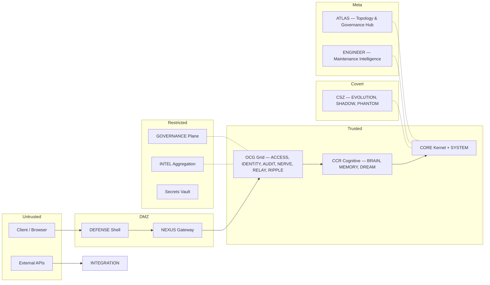

# Security Architecture

## 1. Threat Model Overview

The CMPSBL substrate operates in an adversarial environment where threats originate from:

- **External attackers**: Automated bots, credential stuffing, injection attempts.
- **Malicious API consumers**: Abuse of legitimate access for data exfiltration or cost inflation.
- **Compromised providers**: AI provider outages or manipulated responses.
- **Internal drift**: Configuration errors, unvalidated promotions, governance gaps.
- **Agent runtime escape**: Cognitive agents attempting to breach sealed isolation.
- **Evolution poisoning**: Malicious proposals designed to weaken system integrity.
- **Backup interception**: Unauthorized access to disaster recovery archives.

The security model assumes **zero trust** at every boundary. No component is implicitly trusted; every action is verified.

## 2. Trust Zones Diagram



## 3. Authentication Flow

1. Client presents API key or session token.
2. ACCESS validates the credential against the key store.
3. IDENTITY resolves the authenticated entity.
4. Session is established with scoped permissions.
5. All subsequent requests carry the authenticated context.

| Method | Use Case | Token Lifetime |
|--------|----------|---------------|
| API Key | Developer/programmatic access | Until revoked |
| Session Token | Browser/interactive access | 1 hour (refresh available) |
| Admin Credential | Operator access | 30 minutes (no refresh) |
| Agent JWT | Agent Connect (Evolution CC) | Per-session, scoped to agent |
| Developer Portal Key | External developer API access | Until revoked, scoped per primitive |

## 4. Authorization Model (RBAC Matrix)

| Role | DECODE | ENCODE | VISION | CORTEX | NEXUS | MEMORY | BRAIN | ADMIN | GOVERNANCE |
|------|--------|--------|--------|--------|-------|--------|-------|-------|-----------|
| Free | Read | Read | — | — | Read | — | — | — | — |
| Pro | RW | RW | Read | Read | RW | Read | — | — | — |
| Enterprise | RW | RW | RW | RW | RW | RW | Read | — | — |
| Admin | Full | Full | Full | Full | Full | Full | Full | Full | Read |
| Owner | Full | Full | Full | Full | Full | Full | Full | Full | Full |

**Crown Jewel Capabilities**: 54 capabilities are classified as Crown Jewels — excluded from all external tiers, not visible in API catalogs, admin-only.

**Agent Permissions**: Agents operate within sealed runtimes with 3–5 Crown Jewel powers. Agent access is scoped to their designated powers; no lateral movement.

## 5. Tenant Isolation Strategy

- **Database**: Row-Level Security (RLS) enforces per-user data isolation at the PostgreSQL level.
- **Runtime**: Each request executes within a scoped context; no cross-tenant data leakage.
- **Storage**: File paths are namespaced by tenant ID.
- **Secrets**: AES-GCM encrypted vault with per-module scoping.
- **Audit**: Tenant-scoped audit trails; no cross-tenant log visibility.
- **Agents**: Memory-isolated per agency; no cross-agency state sharing.
- **DREAM Pool**: Consent-gated sharing with configurable privacy levels.
- **Backups**: Disaster recovery archives require authenticated admin session; no anonymous access.

## 6. Data Encryption Model

| State | Method | Key Management |
|-------|--------|---------------|
| At Rest | AES-256 (database-level) | Managed by infrastructure |
| In Transit | TLS 1.3 | Certificate rotation via provider |
| Secrets Vault | AES-GCM | Per-module scoping, operator-managed |
| Backup Archives | Encrypted snapshots + authenticated download | Session-scoped access |
| Agent State | Encrypted per-agent namespace | Sealed runtime keys |

## 7. Secrets Management

- All API keys stored in AES-GCM encrypted vault.
- Secrets are scoped per-module — NEXUS cannot access ECONOMY secrets and vice versa.
- Secret rotation does not require system restart.
- Secret access is logged in AUDIT.
- No secrets are stored in code, environment variables (except infrastructure-level), or client-side storage.

## 8. Rate Limiting Policy (Ironclad Fabric)

The Ironclad v2.0.0 hardening fabric enforces multi-layer rate limiting:

| Tier | Requests/Minute | Requests/Day | Burst Allowance |
|------|-----------------|-------------|----------------|
| Free | 10 | 100 | 2x for 10s |
| Pro | 60 | 5,000 | 3x for 30s |
| Enterprise | 300 | 50,000 | 5x for 60s |
| Admin | 600 | Unlimited | No limit |

### Module-Specific Rate Limits

| Module | Limit | Justification |
|--------|-------|---------------|
| REFLEX | 500/s | High-frequency edge computing |
| NEXUS | 200/s | Provider routing gateway |
| DECODE | 100/s | Conversational throughput |
| EVOLUTION | 5/s | Controlled mutation rate |
| GOVERNANCE | 10/s | Policy evaluation |

Rate limits are enforced at both the NEXUS gateway level and per-module via Ironclad bulkhead isolation. Exceeded limits return HTTP 429 with retry-after header.

## 9. Attack Surface Analysis

| Surface | Exposure | Controls |
|---------|----------|----------|
| NEXUS API Gateway | Public | DEFENSE screening, Ironclad rate limiting, auth required |
| Database | Internal only | RLS, encrypted connections, no direct access |
| Edge Functions | Public (via NEXUS) | Input validation, execution timeout, memory limits |
| AI Providers | Outbound only | Request sanitization, response validation, consensus routing |
| Admin Interface (ATLAS) | Authenticated | MFA, session limits, IP allowlisting |
| Webhook Endpoints | Public | Signature verification, replay protection |
| Agent Runtimes | Isolated | Sealed execution, source-blocked, memory-isolated |
| Evolution Memory Chain | Internal | SEBA 7-gate validation, TSAC verification |
| Developer Portal | Authenticated | API key scoping, per-key rate limits, usage metering |
| Backup Endpoint | Admin-only | Session auth required, no anonymous access |

## 10. Logging & Forensics

- All security events are logged to AUDIT with: timestamp, actor, action, resource, outcome, IP, user agent.
- Logs are append-only and tamper-evident (chain-of-custody checksums).
- Log retention: 90 days for operational, indefinite for security incidents.
- Forensic queries support time-range, actor, action, and resource filtering.
- DEFENSE threat events include full request fingerprint for pattern analysis.
- INTEL aggregation memory chain enriches security signals into IntelCards for governor review.
- First-party analytics track visitor behavior without third-party data leakage.

## 11. Incident Response Workflow

```
1. Detection
   → DEFENSE identifies threat / anomaly detected by telemetry
   → Scanner Orchestrator flags regression or coverage gap

2. Containment
   → Immediate blocking of source (Ironclad rate limit + IP block)
   → Circuit breaker activation if primitive compromised
   → Bulkhead isolation prevents lateral spread

3. Assessment
   → Incident record created in AUDIT
   → Severity classification (Critical / High / Medium / Low)
   → INTEL generates IntelCard for governor dashboard

4. Response
   → Pattern stored in BRAIN for future recognition
   → Alert sent to SYSTEM and ATLAS Node Inbox
   → Related requests reviewed for lateral movement

5. Recovery
   → Credential rotation if needed
   → State verification via integrity seals
   → Ironclad auto-restore loop (30s cycle) monitors recovery
   → Monitoring escalation for 24 hours

6. Post-Incident
   → Root cause analysis documented
   → IMMUNITY adapts defenses
   → EVOLUTION hardens affected paths
   → Scanner Orchestrator regression test added
```

## 12. Covert Systems Zone (CSZ) Security

The CSZ (EVOLUTION, SHADOW, PHANTOM) operates under heightened security:

- **Isolation**: Zone-shielded from production; independent circuit breakers.
- **SHADOW**: All shadow runs write to isolated storage only; no production mutation.
- **PHANTOM**: Decoy operations for threat detection; isolated from real data.
- **EVOLUTION**: 7-gate SEBA memory chain prevents unvalidated changes from reaching production.
- **TSAC**: Truth Shadow Arbitration Check ensures evolution candidates preserve system truth.

## 13. Security Assumptions

- The underlying infrastructure provider (database, edge runtime) is trusted.
- TLS termination is handled correctly by the infrastructure layer.
- Operator credentials are stored securely outside the substrate.
- AI provider responses may be adversarial and must be validated.
- Clock synchronization across primitives is within acceptable bounds.
- Sealed agent runtimes are correctly isolated by the runtime environment.

## 14. Residual Risk Statement

| Risk | Status | Justification |
|------|--------|--------------|
| AI provider response manipulation | Accepted | Mitigated by response validation and consensus routing; full elimination not possible |
| Infrastructure-level compromise | Accepted | Outside substrate boundary; mitigated by encryption at rest |
| Zero-day in runtime environment | Accepted | Mitigated by regular patching; detection via DEFENSE behavioral analysis |
| Social engineering of operator | Accepted | Mitigated by MFA and audit trail; human factor not fully eliminable |
| Agent sealed runtime escape | Accepted | Mitigated by memory isolation + source blocking; theoretically possible in runtime bugs |
| Backup archive interception | Accepted | Mitigated by session-only access and HTTPS transport; archive is point-in-time data only |

## 15. Revision History

| Date | Author | Change |
|------|--------|--------|
| 2026-03-12 | System | v14.1.0 MINDGAMES — Updated to 40-primitive topology, added ATLAS/ENGINEER to trust zones, developer portal security, backup endpoint security, first-party analytics |
| 2026-03-03 | System | Added Ironclad fabric, CSZ security, agent isolation, INTEL/Scanner integration, consensus routing |
| 2026-03-03 | System | Verified against 38-node topology and zone-shielded architecture |
| 2026-03-01 | System | Initial canonical security architecture |

---

© 2025–2026 CMPSBL®. All rights reserved.
