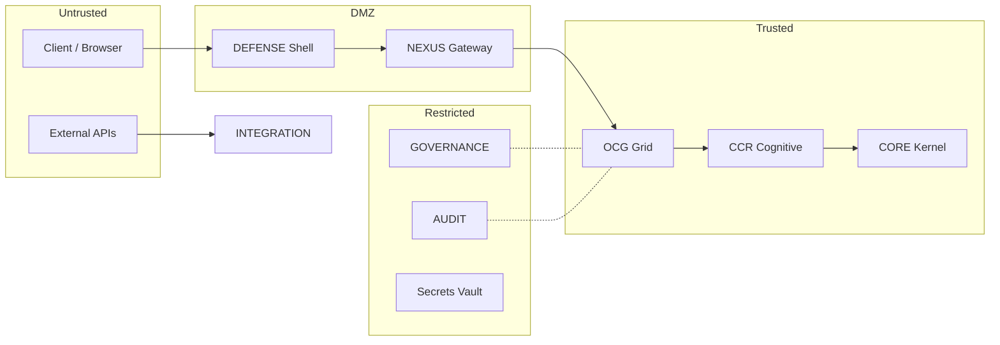

# Security Architecture

## 1. Threat Model Overview

The CMPSBL substrate operates in an adversarial environment where threats originate from:

- **External attackers**: Automated bots, credential stuffing, injection attempts.
- **Malicious API consumers**: Abuse of legitimate access for data exfiltration or cost inflation.
- **Compromised providers**: AI provider outages or manipulated responses.
- **Internal drift**: Configuration errors, unvalidated promotions, governance gaps.

The security model assumes **zero trust** at every boundary. No component is implicitly trusted; every action is verified.

## 2. Trust Zones Diagram



## 3. Authentication Flow

1. Client presents API key or session token.
2. ACCESS validates the credential against the key store.
3. IDENTITY resolves the authenticated entity.
4. Session is established with scoped permissions.
5. All subsequent requests carry the authenticated context.

| Method | Use Case | Token Lifetime |
|--------|----------|---------------|
| API Key | Developer/programmatic access | Until revoked |
| Session Token | Browser/interactive access | 1 hour (refresh available) |
| Admin Credential | Operator access | 30 minutes (no refresh) |

## 4. Authorization Model (RBAC Matrix)

| Role | DECODE | ENCODE | VISION | CORTEX | NEXUS | MEMORY | BRAIN | ADMIN | GOVERNANCE |
|------|--------|--------|--------|--------|-------|--------|-------|-------|-----------|
| Free | Read | Read | — | — | Read | — | — | — | — |
| Pro | RW | RW | Read | Read | RW | Read | — | — | — |
| Enterprise | RW | RW | RW | RW | RW | RW | Read | — | — |
| Admin | Full | Full | Full | Full | Full | Full | Full | Full | Read |
| Owner | Full | Full | Full | Full | Full | Full | Full | Full | Full |

**Crown Jewel Capabilities**: 54 capabilities are classified as Crown Jewels — excluded from all external tiers, not visible in API catalogs, admin-only.

## 5. Tenant Isolation Strategy

- **Database**: Row-Level Security (RLS) enforces per-user data isolation at the PostgreSQL level.
- **Runtime**: Each request executes within a scoped context; no cross-tenant data leakage.
- **Storage**: File paths are namespaced by tenant ID.
- **Secrets**: AES-GCM encrypted vault with per-module scoping.
- **Audit**: Tenant-scoped audit trails; no cross-tenant log visibility.

## 6. Data Encryption Model

| State | Method | Key Management |
|-------|--------|---------------|
| At Rest | AES-256 (database-level) | Managed by infrastructure |
| In Transit | TLS 1.3 | Certificate rotation via provider |
| Secrets Vault | AES-GCM | Per-module scoping, operator-managed |
| Backup | Encrypted snapshots | Same key hierarchy |

## 7. Secrets Management

- All API keys stored in AES-GCM encrypted vault.
- Secrets are scoped per-module — NEXUS cannot access ECONOMY secrets and vice versa.
- Secret rotation does not require system restart.
- Secret access is logged in AUDIT.
- No secrets are stored in code, environment variables (except infrastructure-level), or client-side storage.

## 8. Rate Limiting Policy

| Tier | Requests/Minute | Requests/Day | Burst Allowance |
|------|-----------------|-------------|----------------|
| Free | 10 | 100 | 2x for 10s |
| Pro | 60 | 5,000 | 3x for 30s |
| Enterprise | 300 | 50,000 | 5x for 60s |
| Admin | 600 | Unlimited | No limit |

Rate limits are enforced at the NEXUS gateway level. Exceeded limits return HTTP 429 with retry-after header.

## 9. Attack Surface Analysis

| Surface | Exposure | Controls |
|---------|----------|----------|
| NEXUS API Gateway | Public | DEFENSE screening, rate limiting, auth required |
| Database | Internal only | RLS, encrypted connections, no direct access |
| Edge Functions | Public (via NEXUS) | Input validation, execution timeout, memory limits |
| AI Providers | Outbound only | Request sanitization, response validation |
| Admin Interface | Authenticated | MFA, session limits, IP allowlisting |
| Webhook Endpoints | Public | Signature verification, replay protection |

## 10. Logging & Forensics

- All security events are logged to AUDIT with: timestamp, actor, action, resource, outcome, IP, user agent.
- Logs are append-only and tamper-evident (chain-of-custody checksums).
- Log retention: 90 days for operational, indefinite for security incidents.
- Forensic queries support time-range, actor, action, and resource filtering.
- DEFENSE threat events include full request fingerprint for pattern analysis.

## 11. Incident Response Workflow

```
1. Detection
   → DEFENSE identifies threat / anomaly detected by telemetry

2. Containment
   → Immediate blocking of source
   → Circuit breaker activation if module compromised

3. Assessment
   → Incident record created in AUDIT
   → Severity classification (Critical / High / Medium / Low)

4. Response
   → Pattern stored in BRAIN for future recognition
   → Alert sent to SYSTEM
   → Related requests reviewed for lateral movement

5. Recovery
   → Credential rotation if needed
   → State verification via integrity seals
   → Monitoring escalation for 24 hours

6. Post-Incident
   → Root cause analysis documented
   → IMMUNITY adapts defenses
   → EVOLUTION hardens affected paths
```

## 12. Security Assumptions

- The underlying infrastructure provider (database, edge runtime) is trusted.
- TLS termination is handled correctly by the infrastructure layer.
- Operator credentials are stored securely outside the substrate.
- AI provider responses may be adversarial and must be validated.
- Clock synchronization across nodes is within acceptable bounds.

## 13. Residual Risk Statement

| Risk | Status | Justification |
|------|--------|--------------|
| AI provider response manipulation | Accepted | Mitigated by response validation; full elimination not possible |
| Infrastructure-level compromise | Accepted | Outside substrate boundary; mitigated by encryption at rest |
| Zero-day in runtime environment | Accepted | Mitigated by regular patching; detection via DEFENSE behavioral analysis |
| Social engineering of operator | Accepted | Mitigated by MFA and audit trail; human factor not fully eliminable |

## 14. Revision History

| Date | Author | Change |
|------|--------|--------|
| 2026-03-01 | System | Initial canonical security architecture |

---

© 2025–2026 PromptFluid®. All rights reserved.
