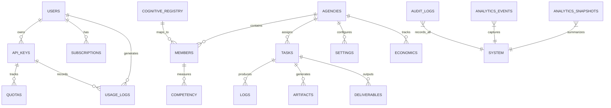

# Data & Memory Model

## 1. Data Architecture Overview

The substrate's data layer is built on PostgreSQL with Row-Level Security (RLS), providing per-user data isolation, real-time subscriptions, and transactional guarantees. The memory system operates across three tiers to balance performance, cost, and durability.

## 2. ER Diagram



## 3. Schema Registry

| Table Family | Tables | Purpose |
|-------------|--------|---------|
| Access Control | `access_api_keys`, `access_developers`, `access_products`, `access_subscriptions`, `access_quotas`, `access_usage` | Authentication, authorization, billing |
| Agency | `agencies`, `agency_members`, `agency_tasks`, `agency_settings`, `agency_economics`, `agency_task_logs`, `agency_task_artifacts`, `agency_task_deliverables` | Multi-agent orchestration |
| Agency Extended | `agency_dream_pool`, `agency_dream_memory`, `agency_dream_consent`, `agency_scheduled_tasks`, `agency_email_queue`, `agency_agent_telemetry`, `agency_api_calls`, `agency_purchases`, `agency_templates` | Agency lifecycle and automation |
| AI Operations | `ai_usage_log`, `ai_daily_quota`, `ai_learning_data` | Provider usage, quotas, learning |
| Analytics | `analytics_events`, `analytics_snapshots` | System telemetry and reporting |
| Audit | `audit_logs` | Immutable event logging |
| Content | `auto_blog_posts`, `auto_blog_schedule`, `autoblog_queue`, `autoblog_drafts` | Automated content generation |
| Cognitive | `cognitive_registry`, `agent_competency` | Agent identity and skill tracking |
| Capabilities | `atlas_capabilities` | Feature flag and capability registry |
| Scanning | `access_scans`, `accessibility_scans` | Security and accessibility scanning |
| Activation | `activation_audit_log` | Pack activation tracking |

## 4. Revision Model

- All critical tables include `created_at` and `updated_at` timestamps.
- Audit logs are append-only — no updates or deletes permitted.
- Schema changes follow migration-based versioning with rollback scripts.
- Every migration is tested against existing data before application.

## 5. Retention Policy

| Data Category | Retention | Justification |
|--------------|-----------|--------------|
| Audit logs (security) | Indefinite | Compliance, forensics |
| Audit logs (operational) | 90 days | Operational debugging |
| Usage logs | 12 months | Billing reconciliation |
| Analytics events | 6 months | Performance analysis |
| Analytics snapshots | 24 months | Trend analysis |
| Task logs | 6 months | Agent performance review |
| Dream pool entries | Until agency deletion | Agent learning |
| Learning data | 12 months | Model improvement |

## 6. Memory Tier Definitions

| Tier | Storage | Access Time | Use Case |
|------|---------|------------|----------|
| **Hot** | In-memory (runtime state) | < 1ms | Active session context, circuit breaker state, routing cache |
| **Warm** | PostgreSQL (indexed) | < 50ms | Recent memory, active tasks, current subscriptions |
| **Cold** | PostgreSQL (archived) | < 500ms | Historical analytics, completed tasks, expired sessions |

### Tier Transitions

- Hot → Warm: On session end or after 15 minutes of inactivity.
- Warm → Cold: After retention policy threshold (varies by data category).
- Cold → Warm: On-demand retrieval with caching for repeated access.
- Cold → Deletion: After retention period expires (automated cleanup).

## 7. Migration Strategy

1. All schema changes are expressed as SQL migration files.
2. Migrations are versioned and applied in strict order.
3. Every migration includes a rollback script.
4. Migrations are tested against a copy of production data before deployment.
5. Zero-downtime migrations are required — no table locks exceeding 5 seconds.
6. Column additions must include default values to prevent write failures.

## 8. Backup & Restore

| Component | Method | Frequency | RPO | RTO |
|-----------|--------|-----------|-----|-----|
| Database | Point-in-time recovery | Continuous WAL | < 1 minute | < 30 minutes |
| Snapshots | Full database snapshot | Daily | 24 hours | < 1 hour |
| Configuration | Version-controlled files | On change | 0 (git) | < 5 minutes |
| Secrets | Encrypted export | Weekly | 7 days | < 15 minutes |

## 9. Multi-Tenant Strategy

- **Logical isolation**: All tables enforce RLS policies scoped to `auth.uid()`.
- **No shared state**: Tenant data never crosses boundaries in queries or caches.
- **Tenant-scoped indexes**: Performance-critical queries include tenant ID in index.
- **Quota enforcement**: Per-tenant limits prevent resource monopolization.
- **Deletion**: Tenant deletion cascades through all related tables.

## 10. Data Lifecycle

```
Creation → Validation → Storage → Active Use → Archival → Deletion
    ↑                                               |
    └─── Retrieval (warm-up from cold) ─────────────┘
```

- **Creation**: Data enters through validated API endpoints or internal processes.
- **Validation**: Schema validation, RLS check, quota check.
- **Storage**: Written to appropriate table with timestamps.
- **Active Use**: Queried, updated, referenced by runtime processes.
- **Archival**: Moved to cold tier after retention threshold.
- **Deletion**: Purged after retention period or on tenant deletion.

## 11. Data Integrity Guarantees

| Guarantee | Mechanism |
|-----------|-----------|
| Referential integrity | Foreign key constraints |
| Type safety | Column type enforcement, check constraints |
| Uniqueness | Unique indexes on identity columns |
| Consistency | Transactional writes, atomic commits |
| Durability | WAL-based persistence, point-in-time recovery |
| Isolation | RLS, per-request scoped context |
| Auditability | Append-only audit log with checksums |

## 12. Revision History

| Date | Author | Change |
|------|--------|--------|
| 2026-03-01 | System | Initial canonical data and memory model |

---

© 2025–2026 PromptFluid®. All rights reserved.
