# Data & Memory Model

## 1. Data Architecture Overview

The substrate's data layer is built on PostgreSQL with Row-Level Security (RLS), providing per-user data isolation, real-time subscriptions, and transactional guarantees. The memory system operates across three tiers to balance performance, cost, and durability. Automated tier enforcement cascades entries from hot → warm → cold → pruned → expired.

## 2. ER Diagram

```mermaid
erDiagram
    USERS ||--o{ API_KEYS : owns
    USERS ||--o{ SUBSCRIPTIONS : has
    USERS ||--o{ USAGE_LOGS : generates
    API_KEYS ||--o{ QUOTAS : tracks
    API_KEYS ||--o{ USAGE_LOGS : records

    AGENCIES ||--o{ MEMBERS : contains
    AGENCIES ||--o{ TASKS : assigns
    AGENCIES ||--o{ SETTINGS : configures
    AGENCIES ||--o{ ECONOMICS : tracks
    AGENCIES ||--o{ DREAM_POOL : collects
    AGENCIES ||--o{ DREAM_MEMORY : learns
    AGENCIES ||--o{ DREAM_CONSENT : governs
    AGENCIES ||--o{ SCHEDULED_TASKS : automates
    AGENCIES ||--o{ EMAIL_QUEUE : dispatches
    MEMBERS ||--o{ COMPETENCY : measures
    MEMBERS ||--o{ TELEMETRY : reports
    TASKS ||--o{ LOGS : produces
    TASKS ||--o{ ARTIFACTS : generates
    TASKS ||--o{ DELIVERABLES : outputs
    TASKS ||--o{ API_CALLS : invokes

    COGNITIVE_REGISTRY ||--o{ MEMBERS : maps_to
    AUDIT_LOGS }|--|| SYSTEM : records_all

    ANALYTICS_EVENTS }|--|| SYSTEM : captures
    ANALYTICS_SNAPSHOTS }|--|| SYSTEM : summarizes

    AUTOBLOG_POSTS ||--o{ ASSUMPTIONS : extracts
    AUTOBLOG_POSTS ||--o{ SPLIT_BRAIN : evaluates
    AUTOBLOG_POSTS ||--o{ MEMORY_REPORTS : analyzes
    AUTOBLOG_SCHEDULE ||--o{ PUBLISH_CYCLE : governs

    DEVELOPERS ||--o{ DEV_API_KEYS : generates
    DEVELOPERS ||--o{ DEV_SUBSCRIPTIONS : subscribes
    DEV_API_KEYS ||--o{ DEV_QUOTAS : meters
    DEV_API_KEYS ||--o{ DEV_USAGE : tracks
```



## 3. Schema Registry

| Table Family | Tables | Purpose |
|-------------|--------|---------|
| Access Control | `access_api_keys`, `access_developers`, `access_products`, `access_subscriptions`, `access_quotas`, `access_usage`, `access_scans` | Authentication, authorization, billing, developer API access |
| Agency Core | `agencies`, `agency_members`, `agency_tasks`, `agency_settings`, `agency_economics`, `agency_task_logs`, `agency_task_artifacts`, `agency_task_deliverables`, `agency_purchases`, `agency_templates` | Multi-agent orchestration and commerce |
| Agency Extended | `agency_dream_pool`, `agency_dream_memory`, `agency_dream_consent`, `agency_scheduled_tasks`, `agency_email_queue`, `agency_agent_telemetry`, `agency_api_calls` | DREAM synthesis, automation, telemetry |
| AI Operations | `ai_usage_log`, `ai_daily_quota`, `ai_learning_data` | Provider usage, quotas, learning |
| Analytics | `analytics_events`, `analytics_snapshots`, `analytics_excluded_fingerprints` | System telemetry, visitor analytics, owner exclusion |
| Audit | `audit_logs`, `audit_chain_anchors`, `activation_audit_log` | Immutable event logging, tamper-evident chains |
| AutoBlog Core | `auto_blog_posts`, `auto_blog_schedule` | Automated content generation |
| AutoBlog Quality | `autoblog_queue`, `autoblog_drafts`, `autoblog_assumptions`, `autoblog_memory_reports`, `autoblog_split_brain_audits`, `autoblog_confidence_weights`, `autoblog_topic_seeds`, `autoblog_publish_cycle`, `autoblog_publish_governor_state`, `autoblog_publish_governor_logs` | Quality pipeline, confidence engine, contradiction engine, semantic drift detection, adaptive governance |
| Cognitive | `cognitive_registry`, `agent_competency` | Agent identity and skill tracking |
| Capabilities | `atlas_capabilities` | Feature flag and capability registry |
| Scanning | `accessibility_scans` | Accessibility scanning |

**Total: 60+ tables across 11 families.**

## 4. CLM (Constant Learning Mode) Data Model

CLM operates as a high-velocity training memory chain generating data across existing tables:

- **Topic Sourcing**: 70% from ENGINEER findings + INTEL signals, 30% from scheduled curriculum.
- **Training Records**: Stored in `ai_learning_data` with CLM-specific metadata tags.
- **Mastery Tracking**: Confidence scores per topic tracked in `ai_daily_quota` with category tags.
- **Distillation**: Mature knowledge compressed and promoted to MEMORY tier via `agency_dream_memory`.
- **Throughput**: Up to 14,400 calls/day (10 calls/min sustained).

## 5. Revision Model

- All critical tables include `created_at` and `updated_at` timestamps.
- Audit logs are append-only — no updates or deletes permitted.
- Schema changes follow migration-based versioning with rollback scripts.
- Every migration is tested against existing data before application.
- Control plane persistence includes WAL (Write-Ahead Log) with revision stamps and SHA-256 snapshot hashes.

## 6. Retention Policy

| Data Category | Retention | Justification |
|--------------|-----------|--------------|
| Audit logs (security) | Indefinite | Compliance, forensics |
| Audit logs (operational) | 90 days | Operational debugging |
| Usage logs | 12 months | Billing reconciliation |
| Analytics events | 6 months | Performance analysis |
| Analytics snapshots | 24 months | Trend analysis |
| Task logs | 6 months | Agent performance review |
| Dream pool entries | Until agency deletion | Agent learning |
| Learning data (CLM) | 12 months | Model improvement, distillation |
| AutoBlog drafts | 90 days | Editorial review |
| AutoBlog quality audits | 6 months | Confidence calibration |
| INTEL signals | 30 days | Aggregation pipeline throughput |
| Scanner findings | 12 months | Regression detection baseline |
| Visitor analytics | 6 months | Behavioral intelligence |
| Developer usage metrics | 12 months | API adoption tracking |

## 7. Memory Tier Definitions

| Tier | Storage | Access Time | Use Case | Capacity Limit |
|------|---------|------------|----------|----------------|
| **Hot** | In-memory (runtime state) | < 1ms | Active session context, circuit breaker state, routing cache, INTENT affinity matrix | 500 entries |
| **Warm** | PostgreSQL (indexed) | < 50ms | Recent memory, active tasks, current subscriptions, CLM active topics | 5,000 entries |
| **Cold** | PostgreSQL (archived) | < 500ms | Historical analytics, completed tasks, expired sessions, distilled knowledge | 50,000 entries |

### Tier Transitions

- Hot → Warm: On session end, after 15 minutes of inactivity, or when capacity limit exceeded.
- Warm → Cold: After retention policy threshold (varies by data category).
- Cold → Warm: On-demand retrieval with caching for repeated access.
- Cold → Deletion: After retention period expires (automated cleanup).
- CLM Distillation: Warm learning data → compressed Cold knowledge → MEMORY Organ integration.
- **Emergency cascade**: When any tier exceeds 2x capacity, bulk demotion activates automatically.

## 8. DREAM Synthesis Data Model

The agency DREAM system manages self-improvement cycles:

- **Dream Pool** (`agency_dream_pool`): Shared insights with consent-gated visibility.
- **Dream Memory** (`agency_dream_memory`): Versioned improvement records with confidence scoring.
- **Dream Consent** (`agency_dream_consent`): Per-agency privacy controls for pooling.
- **Layers**: `heuristic`, `workflow`, `knowledge`, `behavior` — each tracked independently.

## 9. Migration Strategy

1. All schema changes are expressed as SQL migration files.
2. Migrations are versioned and applied in strict order.
3. Every migration includes a rollback script.
4. Migrations are tested against a copy of production data before deployment.
5. Zero-downtime migrations are required — no table locks exceeding 5 seconds.
6. Column additions must include default values to prevent write failures.

## 10. Backup & Restore

| Component | Method | Frequency | RPO | RTO |
|-----------|--------|-----------|-----|-----|
| Database | Point-in-time recovery | Continuous WAL | < 1 minute | < 30 minutes |
| Snapshots | Full database snapshot | Daily | 24 hours | < 1 hour |
| Configuration | Version-controlled files | On change | 0 (git) | < 5 minutes |
| Secrets | Encrypted export | Weekly | 7 days | < 15 minutes |
| Control Plane | WAL + revision stamps | Every commit | < 1 revision | < 10 minutes |
| **Full System** | **One-click disaster recovery ZIP** | **On-demand (admin)** | **Point-in-time** | **< 2 hours** |

### Disaster Recovery Backup

The substrate includes a one-click full backup system accessible from the admin dashboard:

- Exports all database tables as paginated JSON (handles >1,000 row tables).
- Captures OpenAPI schema spec for column types and relationships.
- Inventories all storage buckets and file metadata.
- Generates an AI-ready `RESTORE.md` with step-by-step reconstruction instructions.
- Archives are timestamped (`cmpsbl-full-backup-YYYY-MM-DD-HH-MM-SS.zip`) for point-in-time identification.
- Any coding agent can restore the full system from the archive without external dependencies.

## 11. Multi-Tenant Strategy

- **Logical isolation**: All tables enforce RLS policies scoped to `auth.uid()`.
- **No shared state**: Tenant data never crosses boundaries in queries or caches.
- **Tenant-scoped indexes**: Performance-critical queries include tenant ID in index.
- **Quota enforcement**: Per-tenant limits prevent resource monopolization.
- **Deletion**: Tenant deletion cascades through all related tables.
- **Agent isolation**: Per-agency memory boundaries enforced at database level.

## 12. Data Lifecycle

```
Creation → Validation → Storage → Active Use → Archival → Deletion
    ↑                                               |
    └─── Retrieval (warm-up from cold) ─────────────┘
                        ↑
    CLM Distillation ───┘ (knowledge compounding)
```

- **Creation**: Data enters through validated API endpoints or internal processes.
- **Validation**: Schema validation, RLS check, quota check.
- **Storage**: Written to appropriate table with timestamps.
- **Active Use**: Queried, updated, referenced by runtime processes.
- **Archival**: Moved to cold tier after retention threshold.
- **Deletion**: Purged after retention period or on tenant deletion.
- **Distillation**: CLM-learned knowledge compressed and promoted to permanent MEMORY.
- **Backup**: Full system state captured on-demand for disaster recovery.

## 13. Data Integrity Guarantees

| Guarantee | Mechanism |
|-----------|-----------|
| Referential integrity | Foreign key constraints |
| Type safety | Column type enforcement, validation triggers |
| Uniqueness | Unique indexes on identity columns |
| Consistency | Transactional writes, atomic commits |
| Durability | WAL-based persistence, point-in-time recovery |
| Isolation | RLS, per-request scoped context |
| Auditability | Append-only audit log with checksums |
| Snapshot integrity | SHA-256 content-addressable hashes |
| Tier capacity | Automated enforcement with bulk demotion |

## 14. Revision History

| Date | Author | Change |
|------|--------|--------|
| 2026-03-12 | System | v14.1.0 MINDGAMES — Updated to 40-primitive taxonomy, added disaster recovery backup system, memory tier capacity enforcement, developer API data model, visitor analytics tables, 60+ tables |
| 2026-03-03 | System | Added CLM data model, DREAM synthesis, INTEL retention, control plane persistence, expanded schema registry to 50+ tables |
| 2026-03-03 | System | Added AutoBlog quality memory chain tables |
| 2026-03-01 | System | Initial canonical data and memory model |

---

© 2025–2026 PromptFluid®. All rights reserved.
