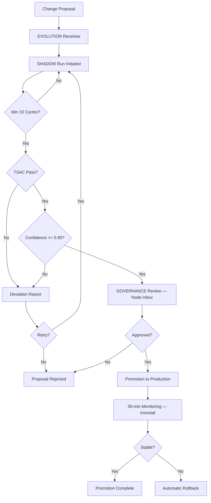

# Evolution & Versioning Framework

## 1. Evolution Philosophy

The substrate evolves through validated, auditable transitions rather than ad-hoc changes. Every modification to production behavior must pass through the EVOLUTION module's shadow-run pipeline before promotion. This ensures that changes are tested against real conditions, scored for confidence, and reversible.

Evolution is a system property, not a deployment event.

## 2. Version Naming Policy

| Component | Format | Example |
|-----------|--------|---------|
| Epoch (major) | vN.0.0 | v14.0.0 |
| Minor release | vN.M.0 | v14.1.0 |
| Patch | vN.M.P | v14.1.3 |
| Epoch name | ALL CAPS word | MINDGAMES |

- Epochs represent architectural boundaries and may introduce breaking changes.
- Minor versions maintain backward compatibility within the epoch.
- Patches contain fixes only — no behavioral changes.
- Epoch names are chosen for thematic significance, not marketing.

### Epoch History

| Epoch | Version Range | Significance |
|-------|--------------|--------------|
| INFRASTRUCTURE | v1.0–v12.x | The substrate grew organs |
| IRONCLAD | v13.0–v13.x | The substrate grew armor |
| MINDGAMES | v14.0–current | The substrate opened its eyes and saw users |

## 3. Evolution Architecture (CSZ)

Evolution operates within the **Covert Systems Zone** (CSZ) containing three nodes:

| Node | Role |
|------|------|
| **EVOLUTION** | Proposal intake, SEBA pipeline orchestration, promotion execution |
| **SHADOW** | Isolated shadow runs, divergence scoring, behavioral comparison |
| **PHANTOM** | Decoy operations, threat detection, A/B variant testing |

The CSZ is zone-shielded — failures within it cannot propagate to production.

## 4. Shadow Run Model

A shadow run is a trial execution of a proposed change against real inputs, writing results to isolated storage rather than production.

### Shadow Run Lifecycle

```
Proposal → Validation → Shadow Execution → Comparison → Scoring → Report
                                                            ↓
                                              [Pass] → Promotion Eligible
                                              [Fail] → Deviation Report
```

### Isolation Guarantees

- Shadow runs share read access to production data.
- Shadow writes go to a dedicated shadow namespace.
- Shadow runs cannot trigger AUDIT production entries.
- Shadow run metrics are tracked separately from production.

### Divergence Scoring Formula

```
divergence = 0.50 × output_divergence + 0.30 × latency_divergence + 0.20 × error_divergence
```

- Divergence < 0.05: Pass (high fidelity)
- Divergence 0.05–0.15: Review required
- Divergence > 0.15: Fail

## 5. 7-Gate SEBA Validation Pipeline

| Gate | Check | Threshold | Owner |
|------|-------|-----------|-------|
| 1. Schema | Migration compatibility | Must pass | EVOLUTION |
| 2. Behavioral | Output equivalence vs. production | ≥ 95% | SHADOW |
| 3. TSAC | Truth Shadow Arbitration Check | Divergence < 0.05 | SHADOW |
| 4. Performance | Latency regression | < 10% degradation | EVOLUTION |
| 5. Error Rate | Errors during shadow run | < 1% | EVOLUTION |
| 6. GOVERNANCE | GOVERNANCE approval via Node Inbox | Required | GOVERNANCE |
| 7. Security | DEFENSE review (if trust boundary crossed) | Required | DEFENSE |

### TSAC (Truth Shadow Arbitration Check)

Gate 3 — TSAC — is a specialized validation ensuring evolution candidates preserve system truth:

- Compares shadow output semantic equivalence against production truth baseline.
- Detects meaning drift even when syntactic output differs.
- Flags candidates that subtly alter system behavior without explicit intent.
- TSAC failures trigger mandatory governor review with full divergence report.

## 6. Confidence Scoring Logic

Confidence is a weighted score combining shadow run results:

```
confidence = (
  0.40 × behavioral_equivalence +
  0.20 × error_rate_score +
  0.15 × performance_score +
  0.15 × resource_score +
  0.10 × sample_size_score
)
```

| Score Range | Classification | Action |
|-------------|---------------|--------|
| 0.95–1.00 | High confidence | Auto-eligible for promotion |
| 0.85–0.94 | Moderate confidence | Manual review required |
| 0.70–0.84 | Low confidence | Additional shadow runs needed |
| < 0.70 | Insufficient | Proposal rejected |

## 7. Convergence Criteria

A change is considered converged when:

1. Minimum 10 shadow cycles completed.
2. Confidence score ≥ 0.95 for 3 consecutive cycles.
3. No regression in any validation gate.
4. GOVERNANCE has not vetoed.
5. Rollback plan is documented and tested.
6. TSAC divergence < 0.05 for all cycles.

## 8. Evolution Control Center

The Evolution Control Center (`/evolution`) provides mission-control UI:

| Feature | Description |
|---------|-------------|
| **Pipeline View** | Real-time SEBA gate status for all active proposals |
| **Shadow Run Dashboard** | Divergence scores, cycle counts, pass/fail history |
| **Dry-Run Preview** | Impact analysis before promotion — shows affected modules and dependencies |
| **One-Click Rollback** | Restore previous state from snapshot + WAL replay |
| **Scan Trends** | Scanner Orchestrator findings over time, regression detection |
| **Agent Connect** | JWT-authenticated external agent integration for automated proposals |

### ENGINEER Integration

The ENGINEER node generates evolution proposals based on:
- Health scan findings across 76 engines and 24 meta-engines.
- CLM topic mastery signals indicating capability readiness.
- INTEL enriched signals flagging optimization opportunities.

ENGINEER proposals enter the SEBA pipeline at Gate 1 and follow the same validation path as manual proposals.

## 9. Promotion Workflow Diagram



## 10. Rollback Triggers

### Automatic Rollback

- Error rate exceeds 5% within 5 minutes of promotion.
- CORE integrity score drops below 0.700.
- Any Spine module enters circuit-breaker open state.
- GOVERNANCE issues post-promotion veto.
- Ironclad detects bulkhead pressure exceeding safe threshold.
- Scanner Orchestrator detects regression in promoted change.

### Manual Rollback

- Operator initiates via Evolution Control Center one-click rollback.
- Restores previous state from snapshot + WAL replay.
- Rollback is logged in AUDIT with operator identity and justification.
- Dry-run preview available before execution.

## 11. Immutable Revision Stamping

Every promoted change receives an immutable revision stamp:

```json
{
  "revision_id": "uuid",
  "epoch": "MINDGAMES",
  "version": "14.1.0",
  "promoted_at": "ISO-8601",
  "confidence_score": 0.97,
  "shadow_cycles": 14,
  "tsac_divergence": 0.02,
  "seba_gates_passed": 7,
  "governance_approver": "system|operator_id",
  "rollback_snapshot": "snapshot_id",
  "checksum": "sha256"
}
```

Revision stamps are stored in AUDIT and cannot be modified or deleted.

## 12. Scanner Orchestrator Integration

The Scanner Orchestrator provides continuous evolution quality monitoring:

- **Regression Detection**: Compares post-promotion metrics against baseline.
- **Coverage Gap Alerts**: Identifies modules without recent shadow runs.
- **Priority Scoring**: Ranks technical debt findings for ENGINEER proposal generation.
- **Trend Analysis**: Tracks finding density over time via Evolution Control Center.

## 13. Compatibility Matrix

| From Version | To Version | Compatibility | Migration Required |
|-------------|-----------|--------------|-------------------|
| v12.x → v13.0 | Epoch boundary | Breaking changes possible | Yes |
| v13.0 → v13.1 | Minor | Backward compatible | Schema migration only |
| v13.x → v14.0 | Epoch boundary (MINDGAMES) | Breaking changes possible | Yes |
| v14.0 → v14.1 | Minor | Backward compatible | Schema migration only |
| v14.1 → v14.1.x | Patch | Fully compatible | No |

## 14. Deprecation Policy

1. Deprecated capabilities are announced one minor version before removal.
2. Deprecated capabilities continue to function during the deprecation window.
3. Deprecation notices include: capability ID, deprecation date, removal version, migration path.
4. Deprecated capabilities emit warning telemetry on each use.
5. Removal occurs at the next minor version boundary.
6. Crown Jewel capabilities are never deprecated — they are either active or removed.

## 15. Revision History

| Date | Author | Change |
|------|--------|--------|
| 2026-03-12 | System | v14.1.0 MINDGAMES — Updated epoch history, compatibility matrix, revision stamp example to MINDGAMES epoch, 40-node references |
| 2026-03-03 | System | Added 7-gate SEBA pipeline, TSAC, CSZ architecture, Evolution Control Center, ENGINEER integration, Scanner Orchestrator, Ironclad references |
| 2026-03-03 | System | Updated to v13.1.0 — AutoBlog quality pipeline, adaptive publish governor |
| 2026-03-01 | System | Initial canonical evolution and versioning framework |

---

© 2025–2026 PromptFluid®. All rights reserved.
