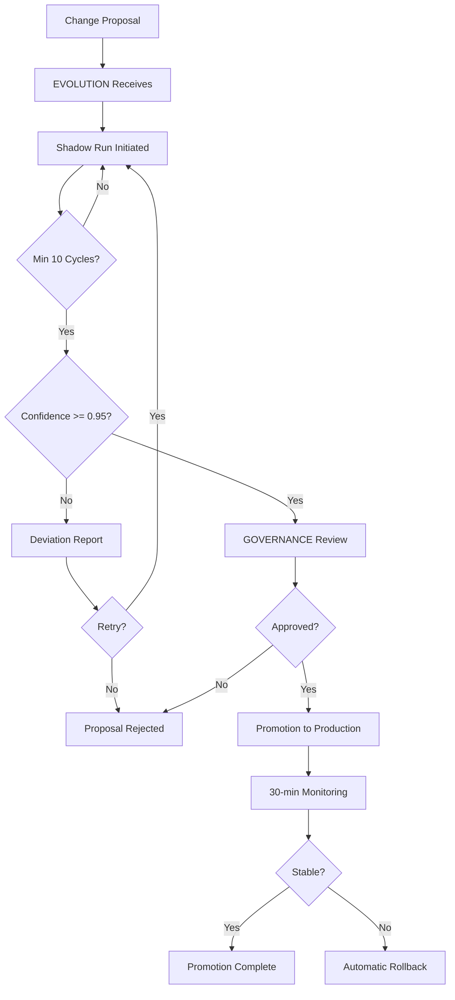

# Evolution & Versioning Framework

## 1. Evolution Philosophy

The substrate evolves through validated, auditable transitions rather than ad-hoc changes. Every modification to production behavior must pass through the EVOLUTION module's shadow-run pipeline before promotion. This ensures that changes are tested against real conditions, scored for confidence, and reversible.

Evolution is a system property, not a deployment event.

## 2. Version Naming Policy

| Component | Format | Example |
|-----------|--------|---------|
| Epoch (major) | vN.0.0 | v13.0.0 |
| Minor release | vN.M.0 | v13.2.0 |
| Patch | vN.M.P | v13.2.3 |
| Epoch name | ALL CAPS word | IRONCLAD |

- Epochs represent architectural boundaries and may introduce breaking changes.
- Minor versions maintain backward compatibility within the epoch.
- Patches contain fixes only — no behavioral changes.
- Epoch names are chosen for thematic significance, not marketing.

## 3. Shadow Run Model

A shadow run is a trial execution of a proposed change against real inputs, writing results to isolated storage rather than production.

### Shadow Run Lifecycle

```
Proposal → Validation → Shadow Execution → Comparison → Scoring → Report
                                                            ↓
                                              [Pass] → Promotion Eligible
                                              [Fail] → Deviation Report
```

### Isolation Guarantees

- Shadow runs share read access to production data.
- Shadow writes go to a dedicated shadow namespace.
- Shadow runs cannot trigger AUDIT production entries.
- Shadow run metrics are tracked separately from production.

## 4. Validation Gates

| Gate | Check | Threshold |
|------|-------|-----------|
| Schema | Migration compatibility | Must pass |
| Behavioral | Output equivalence vs. production | ≥ 95% |
| Performance | Latency regression | < 10% degradation |
| Error Rate | Errors during shadow run | < 1% |
| Resource | Memory/CPU delta | < 20% increase |
| Governance | GOVERNANCE approval | Required |
| Security | DEFENSE review (if trust boundary crossed) | Required |

## 5. Confidence Scoring Logic

Confidence is a weighted score combining shadow run results:

```
confidence = (
  0.40 × behavioral_equivalence +
  0.20 × error_rate_score +
  0.15 × performance_score +
  0.15 × resource_score +
  0.10 × sample_size_score
)
```

| Score Range | Classification | Action |
|-------------|---------------|--------|
| 0.95–1.00 | High confidence | Auto-eligible for promotion |
| 0.85–0.94 | Moderate confidence | Manual review required |
| 0.70–0.84 | Low confidence | Additional shadow runs needed |
| < 0.70 | Insufficient | Proposal rejected |

## 6. Convergence Criteria

A change is considered converged when:

1. Minimum 10 shadow cycles completed.
2. Confidence score ≥ 0.95 for 3 consecutive cycles.
3. No regression in any validation gate.
4. GOVERNANCE has not vetoed.
5. Rollback plan is documented and tested.

## 7. Promotion Workflow Diagram



## 8. Rollback Triggers

### Automatic Rollback

- Error rate exceeds 5% within 5 minutes of promotion.
- CORE integrity score drops below 0.700.
- Any Spine module enters circuit-breaker open state.
- GOVERNANCE issues post-promotion veto.

### Manual Rollback

- Operator initiates via SYSTEM control plane.
- Restores previous state from snapshot + WAL replay.
- Rollback is logged in AUDIT with operator identity and justification.

## 9. Immutable Revision Stamping

Every promoted change receives an immutable revision stamp:

```json
{
  "revision_id": "uuid",
  "epoch": "IRONCLAD",
  "version": "13.1.0",
  "promoted_at": "ISO-8601",
  "confidence_score": 0.97,
  "shadow_cycles": 14,
  "governance_approver": "system|operator_id",
  "rollback_snapshot": "snapshot_id",
  "checksum": "sha256"
}
```

Revision stamps are stored in AUDIT and cannot be modified or deleted.

## 10. Compatibility Matrix

| From Version | To Version | Compatibility | Migration Required |
|-------------|-----------|--------------|-------------------|
| v12.x → v13.0 | Epoch boundary | Breaking changes possible | Yes |
| v13.0 → v13.1 | Minor | Backward compatible | Schema migration only |
| v13.1 → v13.1.x | Patch | Fully compatible | No |
| v13.x → v14.0 | Epoch boundary | Breaking changes possible | Yes |

## 11. Deprecation Policy

1. Deprecated capabilities are announced one minor version before removal.
2. Deprecated capabilities continue to function during the deprecation window.
3. Deprecation notices include: capability ID, deprecation date, removal version, migration path.
4. Deprecated capabilities emit warning telemetry on each use.
5. Removal occurs at the next minor version boundary.
6. Crown Jewel capabilities are never deprecated — they are either active or removed.

## 12. Revision History

| Date | Author | Change |
|------|--------|--------|
| 2026-03-03 | System | Updated to v13.1.0 — AutoBlog quality pipeline, adaptive publish governor, semantic drift detection |
| 2026-03-01 | System | Initial canonical evolution and versioning framework |

---

© 2025–2026 PromptFluid®. All rights reserved.
