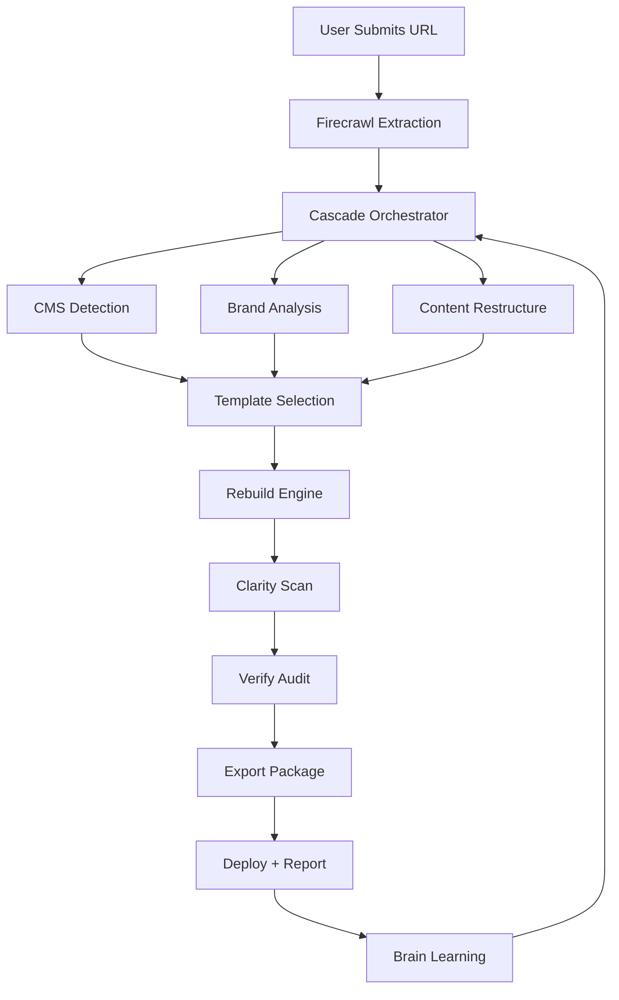

# PromptFluid Studio (Modernizer) — Product Roadmap

**Version:** 1.0  
**Date:** November 4, 2025  
**Credit Allocation:** 80 Lovable Credits  
**Status:** Planning → MVP → Launch

---

## Executive Summary

**PromptFluid Studio (Modernizer)** is an AI-driven modernization tool that transforms outdated websites into fully rebuilt, accessible, SEO-optimized, mobile-first experiences in minutes. Built on the PromptFluid ecosystem, it leverages **Clarity** for accessibility, **Verify** for compliance, and **Cascade** for orchestration and learning.

### Business Positioning
- Bridge between legacy web and intelligent, accessible design
- Recurring-revenue modernization service
- Scales agency and SMB conversions through automation
- Integrates into the PromptFluid IP portfolio

### Target Audience
- **SMBs** with outdated or broken websites
- **Web designers** seeking modernization automation
- **Agencies** offering rebrand/redesign packages
- **Accessibility-focused organizations** requiring WCAG compliance

---

## Product Vision

**Mission:** Make website modernization instant, intelligent, and accessible.

**Core Value Propositions:**
1. **Speed:** Transform any legacy site in minutes, not weeks
2. **Intelligence:** Learn from every rebuild to improve continuously
3. **Compliance:** Built-in WCAG 2.2 + SEO optimization
4. **Ecosystem Synergy:** Shared intelligence with Clarity, Verify, and Cascade

---

## Technical Foundation

### Core Technologies
- **Frontend Framework:** React + Vite + TypeScript
- **Styling:** Tailwind CSS (semantic tokens from PromptFluid design system)
- **Backend:** Supabase Edge Functions
- **AI Orchestration:** Cascade Brain
- **Content Extraction:** Firecrawl API
- **Deployment:** Vercel + Railway

### Ecosystem Integrations
- **Clarity:** Accessibility scanning and auto-fix post-rebuild
- **Verify:** Plugin and code compliance validation
- **Cascade:** Orchestration, multi-provider AI routing, learning loop
- **Brain:** Pattern recognition, CMS detection, brand intelligence

---

## Phase 1 — MVP Activation

**Duration:** Week 1–2  
**Focus:** Core modernization engine with basic extraction and rebuild

### Goals
1. **URL Input & Content Extraction**
   - Firecrawl integration for site scraping
   - Extract text, images, structure, and metadata
   - Handle common CMS structures (WordPress, Wix, basic HTML)

2. **Template Rebuild Engine**
   - Generate Next.js + Tailwind base template
   - Responsive, mobile-first design
   - Single "Modern" theme style

3. **Accessibility & SEO Scoring**
   - Integrate Clarity engine for WCAG scanning
   - Lighthouse-based SEO analysis
   - Generate compliance report

4. **Export Functionality**
   - Download rebuild as Vercel-ready package
   - Include all assets (images, fonts, icons)
   - Deployment instructions

### Deliverables
- Working URL input form
- Single-template modernization engine
- WCAG + SEO report generator
- Vercel-ready export system

### Validation Criteria
✅ Three legacy URLs successfully modernized  
✅ Lighthouse Accessibility ≥95, SEO ≥90  
✅ All exports deploy cleanly to Vercel  
✅ Basic brand colors preserved from original site

### Technical Notes
- Use existing Firecrawl integration patterns
- Leverage Cascade for AI-powered content restructuring
- Store rebuilds in Supabase `modernizer_projects` table
- Log all operations to `brain_events` for learning

---

## Phase 2 — Automation Layer

**Duration:** Week 3–4  
**Focus:** Multi-style themes, queuing, and monetization

### Goals
1. **Multi-Style Theme Generation**
   - **Minimal:** Clean, text-focused, high-contrast
   - **Professional:** Corporate, structured, trust-focused
   - **Creative:** Bold colors, dynamic layouts, visual-first

2. **Job Queue & Orchestration**
   - Supabase job queue for async processing
   - Handle concurrent rebuilds (up to 10 simultaneous)
   - Progress tracking and status updates
   - Email notifications on completion

3. **Pricing & Billing Integration**
   - Stripe one-time payments for rebuilds
   - Subscription tiers (Basic, Pro, Agency)
   - Credits system for bulk purchases
   - Usage tracking and analytics

4. **PDF Modernization Reports**
   - Before/after comparison visuals
   - Accessibility improvements breakdown
   - SEO gains summary
   - Technical architecture notes

### Deliverables
- Three distinct theme styles with preview
- Async job processing system
- Stripe payment integration
- PDF report generator

### Validation Criteria
✅ 10 rebuilds run concurrently with no failures  
✅ All reports export within 30 seconds  
✅ Payment flow tested with real Stripe transactions  
✅ Email notifications delivered successfully

### Technical Notes
- Use `pf-ripple-queue` pattern for job management
- Store theme preferences in user profiles
- Generate PDFs using Puppeteer in edge function
- Track billing events in `modernizer_billing` table

---

## Phase 3 — Adaptive Intelligence

**Duration:** Week 5–6  
**Focus:** AI learning, CMS recognition, brand detection

### Goals
1. **Cascade Learning Loop**
   - Feed every rebuild output back to Brain
   - Learn successful patterns and avoid failures
   - Improve CMS detection accuracy over time
   - Adaptive template selection based on content type

2. **CMS Structure Recognition**
   - Detect WordPress, Wix, Joomla, Squarespace, custom HTML
   - Preserve content hierarchy and relationships
   - Recognize plugins and dynamic content patterns
   - Handle e-commerce structures (WooCommerce, Shopify)

3. **Smart Brand Detection**
   - Extract primary and secondary colors
   - Identify typography patterns and font families
   - Logo detection and optimization
   - Brand voice analysis from copy

4. **AI-Powered Improvement Suggestions**
   - Cascade generates post-rebuild recommendations
   - Suggest layout enhancements
   - Identify missing accessibility features
   - Propose SEO optimizations

### Deliverables
- CMS detection system (5+ platforms)
- Brand intelligence extraction
- AI recommendation engine
- Learning feedback loop integration

### Validation Criteria
✅ System accurately identifies 3+ CMS structures  
✅ Brand colors extracted with 90%+ accuracy  
✅ AI feedback loop generates measurable design improvements  
✅ Recommendations increase user satisfaction by 25%+

### Technical Notes
- Store CMS patterns in `brain_memory_hot` table
- Use computer vision for logo detection
- Implement color clustering algorithm for brand palette
- Feed metadata to Cascade's pattern fusion system

---

## Phase 4 — Best-in-Class Experience

**Duration:** Week 7–8  
**Focus:** Dashboard, analytics, ecosystem integration

### Goals
1. **Admin Dashboard**
   - Real-time rebuild status monitoring
   - Usage analytics and success metrics
   - Revenue tracking and subscription management
   - User activity logs and support tools

2. **Visual Before/After Diff Reports**
   - Side-by-side comparison screenshots
   - Interactive hover states
   - Accessibility score improvements
   - Performance metrics (Lighthouse, Core Web Vitals)

3. **Verify Integration**
   - Automatic plugin security audits for WordPress rebuilds
   - Code compliance scanning
   - Vulnerability detection
   - Safe modernization guarantees

4. **Clarity Auto-Scan Post-Deploy**
   - Trigger accessibility scan immediately after rebuild
   - Generate compliance certificate
   - Add to WebAdoption directory if WCAG-compliant
   - Email user with results

### Deliverables
- Full admin dashboard with analytics
- Before/after visual diff system
- Verify plugin integration
- Clarity auto-trigger functionality

### Validation Criteria
✅ Dashboard aggregates and displays all modernization data  
✅ Reports validated by third-party audit tools  
✅ Verify detects and flags security issues accurately  
✅ Clarity scans complete within 60 seconds of deploy

### Technical Notes
- Build dashboard using existing PromptFluid Vision patterns
- Use Puppeteer for screenshot capture
- Store comparison data in `modernizer_comparisons` table
- Trigger Clarity via `pf-access-unified` endpoint

---

## Phase 5 — Ecosystem Launch & Marketing

**Duration:** Week 9–10  
**Focus:** Public launch, marketing, and investor materials

### Goals
1. **Cascade Brain Integration**
   - All modernization metrics feed to Brain
   - Cross-product learning (Clarity ↔ Modernizer ↔ Verify)
   - Shared intelligence improves all ecosystem products
   - Publish insights to public dream site

2. **PromptFluid Homepage Integration**
   - Add Modernizer to primary navigation
   - Create dedicated product page
   - Include in ecosystem diagram
   - Link from "The Firsts" pillar post

3. **Marketing Materials Generation**
   - Fiverr gig listing (SEO-optimized)
   - Website copy and CTAs
   - Case studies with before/after examples
   - Video demos and tutorials

4. **Investor Documentation**
   - Add Modernizer to IP valuation table
   - Estimated value: $2.0M–$3.5M (15–20% of ecosystem)
   - Revenue projections and growth model
   - Competitive analysis and positioning

### Deliverables
- Live product launch on promptfluid.com
- Fiverr gig published
- Marketing materials (copy, visuals, videos)
- Updated investor packet with valuation

### Validation Criteria
✅ Modernizer visible in ecosystem dashboard and marketing pages  
✅ Investor doc automatically updated with valuation estimate  
✅ Fiverr gig approved and indexed by search  
✅ First 10 paying customers acquired within 2 weeks of launch

### Technical Notes
- Update `src/pages/Index.tsx` with Modernizer CTA
- Create `/modernizer` route with full product page
- Add to `src/components/PublicNav.tsx`
- Update `/pillars/promptfluid-the-firsts` to include Modernizer

---

## Business Model

### Pricing Tiers

| Tier | Price | Features |
|------|-------|----------|
| **Basic** | $49/rebuild | 1 theme style, basic report, 7-day support |
| **Pro** | $149/month | Unlimited rebuilds, 3 themes, priority support |
| **Agency** | $499/month | White-label, custom themes, API access, team seats |

### Revenue Projections (Year 1)
- **Month 1–3:** 50 rebuilds/month × $49 = $2,450/month
- **Month 4–6:** 100 rebuilds + 10 Pro subs = $6,390/month
- **Month 7–12:** 200 rebuilds + 25 Pro + 5 Agency = $13,275/month
- **Year 1 Total:** ~$85,000

### Cost Structure
- **AI Providers:** Free tier routing (Groq, Cerebras, Google)
- **Hosting:** Vercel + Railway (~$100/month)
- **Firecrawl:** Pay-per-use (~$50/month at scale)
- **Support:** Kenneth (founder) + AI assistance

---

## Competitive Analysis

### Competitors
1. **Wix ADI:** Automated site builder, limited modernization
2. **10Web AI Builder:** WordPress-focused, no multi-CMS support
3. **Durable.co:** Simple AI sites, not true modernization
4. **Webflow Templates:** Manual rebuild required

### PromptFluid Advantages
✅ **True Modernization:** Preserves content, updates structure  
✅ **Accessibility-First:** WCAG 2.2 built-in, not added later  
✅ **Ecosystem Intelligence:** Learns from Clarity, Verify, Cascade  
✅ **Multi-CMS Support:** Handles any legacy platform  
✅ **Export Freedom:** Deploy anywhere, not locked to platform

---

## Risk Assessment

### Technical Risks
- **Firecrawl Rate Limits:** Mitigated by queue system and caching
- **AI Provider Downtime:** Multi-provider routing via Cascade
- **Complex CMS Structures:** Fallback to manual review + assistance

### Business Risks
- **Market Education:** Modernization is a new category → content marketing
- **Churn Risk:** One-time purchases → drive subscription adoption
- **Support Burden:** Automated fixes reduce manual work

---

## Success Metrics

### Technical KPIs
- **Rebuild Success Rate:** ≥95%
- **Average Rebuild Time:** <5 minutes
- **Accessibility Score Improvement:** +40 points average
- **SEO Score Improvement:** +30 points average

### Business KPIs
- **Monthly Rebuilds:** 200+ by Month 6
- **Pro Subscription Conversions:** 15% of Basic users
- **Customer Satisfaction:** 4.5+ stars (Fiverr, reviews)
- **Support Ticket Volume:** <5% of rebuilds

---

## Future Enhancements (Post-Launch)

### Phase 6 — Advanced Features (Q1 2026)
- **AI Copywriting:** Rewrite site copy with SEO optimization
- **Multi-Language Support:** Auto-translate rebuilds
- **E-Commerce Integration:** Shopify, WooCommerce auto-setup
- **Version History:** Track rebuild iterations

### Phase 7 — White-Label Platform (Q2 2026)
- **Agency Dashboard:** Manage client rebuilds
- **Custom Branding:** Remove PromptFluid branding
- **API Access:** Integrate into existing agency workflows
- **Reseller Program:** 30% revenue share

---

## Integration Architecture

---

## Technical Implementation Checklist

### Backend (Edge Functions)
- [ ] `pf-modernizer-extract` (Firecrawl integration)
- [ ] `pf-modernizer-rebuild` (template generation)
- [ ] `pf-modernizer-export` (package builder)
- [ ] `pf-modernizer-queue` (job orchestration)
- [ ] `pf-modernizer-report` (PDF generation)

### Frontend (React Components)
- [ ] `ModernizerForm.tsx` (URL input + options)
- [ ] `ThemeSelector.tsx` (style picker)
- [ ] `RebuildProgress.tsx` (real-time status)
- [ ] `BeforeAfterComparison.tsx` (visual diff)
- [ ] `ModernizerDashboard.tsx` (admin view)

### Database Tables
- [ ] `modernizer_projects` (rebuild records)
- [ ] `modernizer_billing` (payments tracking)
- [ ] `modernizer_comparisons` (before/after data)
- [ ] `modernizer_templates` (theme definitions)

### Integrations
- [ ] Clarity API connection
- [ ] Verify API connection
- [ ] Cascade orchestration hooks
- [ ] Brain event logging
- [ ] Stripe billing setup

---

## Launch Timeline

| Week | Phase | Milestones |
|------|-------|------------|
| 1–2 | MVP | Core engine, basic rebuild, export |
| 3–4 | Automation | Themes, queue, billing, reports |
| 5–6 | Intelligence | AI learning, CMS detection, brand |
| 7–8 | Excellence | Dashboard, Verify/Clarity integration |
| 9–10 | Launch | Marketing, investor docs, public release |

---

## Ecosystem Impact

### How Modernizer Enhances Other Products

**Clarity:**
- Provides pre-rebuild accessibility baseline data
- Tests Clarity's auto-fix capabilities at scale
- Feeds accessibility patterns back to Brain

**Verify:**
- Validates plugin security in rebuilt WordPress sites
- Tests Verify's scanning accuracy
- Generates compliance certificates for modernized sites

**Cascade:**
- Orchestrates all AI providers for modernization
- Learns optimal provider selection for each task
- Improves routing intelligence across ecosystem

**Brain:**
- Learns CMS patterns and success factors
- Stores brand intelligence and design preferences
- Feeds back improvements to all products

---

## Investment Valuation Notes

### Modernizer IP Valuation (Q4 2025 Estimate)
- **Technology Value:** $800K–$1.2M (novel AI modernization engine)
- **Market Potential:** $1.0M–$1.5M (growing SMB modernization demand)
- **Ecosystem Synergy:** $200K–$800K (shared intelligence multiplier)

**Total Estimated Value:** $2.0M–$3.5M (15–20% of PromptFluid ecosystem)

### Revenue Potential (5-Year Projection)
- **Year 1:** $85K (ramp-up, market education)
- **Year 2:** $350K (subscription growth, agency tier)
- **Year 3:** $800K (white-label platform, API licensing)
- **Year 4:** $1.5M (international expansion, enterprise)
- **Year 5:** $2.5M+ (platform economies of scale)

---

## Conclusion

**PromptFluid Studio (Modernizer)** represents the next evolution in website transformation — combining instant modernization, accessibility compliance, and ecosystem intelligence into a single, powerful tool.

By leveraging the PromptFluid ecosystem's shared intelligence, Modernizer doesn't just rebuild websites — it makes them **better, smarter, and more accessible** than ever before.

**Status:** Ready for Phase 1 implementation  
**Next Action:** Begin MVP development (Week 1)

---

*This roadmap is a living document and will be updated as the product evolves.*

**Last Updated:** November 4, 2025  
**Owner:** Kenneth Sweet, PromptFluid Founder  
**Review Cycle:** Monthly during development, quarterly post-launch
