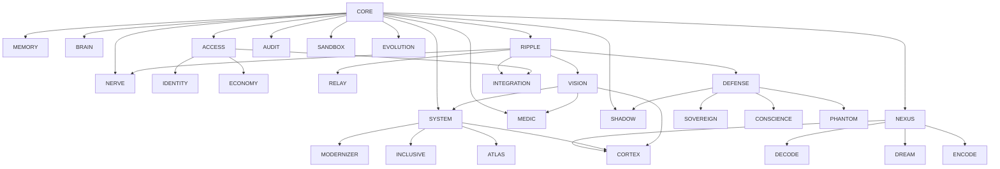

# 01 — Topology & Module Registry

**Classification:** 🔒 INTERNAL  
**Version:** v14.2.0 — MINDGAMES Epoch

---

## 1. Purpose

This document defines the complete 40-node architecture of the CMPSBL Substrate (including expansion nodes ENGINEER #39 and ATLAS #40), organized into 12 canonical sectors, with every node's sector assignment, boot order, dependencies, and responsibility boundary.

## 2. System Topology

The substrate follows a multi-layered topology organized into six architectural zones:

### 2.1 Spine (Vertical Deterministic Flow)

The spine is the backbone execution path. Modules boot in strict order.

```
CORE → SYSTEM → CCR (BRAIN, MEMORY, DREAM) → Execution Modules → INTEGRATION
```

| Module | Role |
|--------|------|
| CORE | Kernel. Boots first. Substrate constants, registry, error boundaries. |
| SYSTEM | Lifecycle management, heartbeats, shutdown coordination. |
| BRAIN | Cognitive knowledge graph, embeddings, classifier models. |
| MEMORY | Persistent knowledge store with SM-2 tiering and WAL. |
| DREAM | Offline optimization cycles, hallucination guards, pattern caching. |

### 2.2 Operational Compliance Grid (OCG)

Six infrastructure modules that enforce operational boundaries:

| Module | Boot Order | Role |
|--------|-----------|------|
| RIPPLE | 4 | Event bus, pub/sub, dead-letter queue. |
| ACCESS | 5 | API keys, quotas, rate limiting, developer subscriptions. |
| IDENTITY | 6 | User/tenant identity resolution, session binding. |
| RELAY | 7 | Webhook delivery, content-hash deduplication. |
| AUDIT | 8 | Immutable compliance trail, tamper-evident logging. |
| NERVE | 9 | Inter-node signaling, consensus repair, distributed heartbeat. |

### 2.3 Execution Layer

Specialized processing modules:

| Module | Boot Order | Dependencies | Role |
|--------|-----------|--------------|------|
| NEXUS | 10 | CORE | AI provider routing, fleet intelligence, cost tracking. |
| DECODE | 11 | CORE, NEXUS | Conversational interpreter, terminal command parsing. |
| DREAM | 12 | CORE, NEXUS | Nocturne offline optimization. |
| ENCODE | 13 | CORE, NEXUS | Output formatting, response shaping. |
| DEFENSE | 14 | CORE, RIPPLE | Security shell, threat detection, honeypots. |
| VISION | 15 | CORE, RIPPLE | Anomaly detection, performance correlation, alerting. |
| ECONOMY | 16 | CORE, ACCESS | Cost tracking, ROI computation, billing integration. |
| SANDBOX | 17 | CORE | Isolated execution environments, code evaluation. |
| INTEGRATION | 18 | CORE, RIPPLE, ACCESS | External service connectors, webhook handlers. |
| MEDIC | 19 | CORE, VISION | Autonomous diagnostics, self-repair coordination, health scoring. |
| INCLUSIVE | 22 | CORE, SYSTEM | Accessibility compliance, WCAG enforcement. |

### 2.4 Orchestration

| Module | Boot Order | Dependencies | Role |
|--------|-----------|--------------|------|
| SYSTEM | 20 | CORE, VISION | System-wide lifecycle, health aggregation. |
| MODERNIZER | 21 | CORE, SYSTEM, VISION | Legacy → routes to EVOLUTION field. |
| CORTEX | 23 | CORE, NEXUS, SYSTEM, VISION | Pipeline orchestration, capability composition. |
| ATLAS | 24 | CORE, SYSTEM | Capability gating, feature flag management. |

### 2.5 ESZ — Expansion Sovereignty Zone

| Module | Boot Order | Dependencies | Role |
|--------|-----------|--------------|------|
| SOVEREIGN | 25 | CORE, DEFENSE, ACCESS | Jurisdiction classification, compliance enforcement. |
| ORACLE | 26 | CORE, BRAIN, VISION | Bayesian prediction, forecasting, scenario modeling. |
| CONSCIENCE | 27 | CORE, DEFENSE | Ethical bias detection, fairness auditing. |
| TREATY | 28 | CORE, SOVEREIGN, ACCESS | Contract enforcement, SLA management. |

### 2.6 EPZ — Expansion Perception Zone

| Module | Boot Order | Dependencies | Role |
|--------|-----------|--------------|------|
| COMPASS | 29 | CORE, VISION, BRAIN | Strategic navigation, trend analysis. |
| ECHO | 30 | CORE, MEMORY | Historical pattern replay, simulation. |
| REFLEX | 31 | CORE, NEXUS, VISION | Edge computing, real-time response. |

### 2.7 EMZ — Expansion Manufacturing Zone

| Module | Boot Order | Dependencies | Role |
|--------|-----------|--------------|------|
| FORGE | 32 | CORE, ENCODE | Content generation, artifact manufacturing. |
| LINGUA | 33 | CORE, DECODE, NEXUS | Translation, multilingual processing. |
| HARVEST | 34 | CORE, MEMORY, ECONOMY | Data collection, ETL pipelines. |

### 2.8 CSZ — Covert Systems Zone

| Module | Boot Order | Dependencies | Role |
|--------|-----------|--------------|------|
| PHANTOM | 35 | CORE, DEFENSE, IDENTITY | Synthetic data, differential privacy, anonymization. |
| SHADOW | 36 | CORE, DEFENSE | Shadow runs, divergence testing, mesh isolation. |
| EVOLUTION | — | CORE | Mutation proposals, shadow validation, promotion pipeline. |

### 2.9 Fields (System-Wide Transformation Fabric)

Fields are not stacked layers — they **permeate** the entire spine:

| Field | Role |
|-------|------|
| IMMUNITY | Self-healing, OCG capability gates, threat correlation. |
| INTENT | User intent classification, context routing, goal tracking. |

### 2.10 Overlay Plane & Shell

| Component | Role |
|-----------|------|
| GOVERNANCE (Plane) | Policy enforcement, veto authority, compliance audit, drift detection. Self-referential. |
| DEFENSE (Shell) | Terminal boundary enforcement. Outermost containment. |

## 3. Boot Order (Canonical — 38 Nodes)

```
Phase 1 — Kernel:        CORE (1)
Phase 2 — System:        SYSTEM (2)
Phase 3 — CCR:           MEMORY (3), BRAIN (4), DREAM (5)
Phase 4 — OCG:           RIPPLE (6), ACCESS (7), IDENTITY (8), RELAY (9), AUDIT (10), NERVE (11)
Phase 5 — Execution:     NEXUS (12), DECODE (13), ENCODE (14),
                         VISION (15), CORTEX (16), ECONOMY (17), SANDBOX (18),
                         INCLUSIVE (19), MEDIC (20), INTEGRATION (21)
Phase 6 — ESZ:           SOVEREIGN (22), ORACLE (23), CONSCIENCE (24), TREATY (25)
Phase 7 — EPZ:           COMPASS (26), ECHO (27), REFLEX (28)
Phase 8 — EMZ:           FORGE (29), LINGUA (30), HARVEST (31)
Phase 9 — CSZ:           PHANTOM (32), SHADOW (33), EVOLUTION (34)
Phase 10 — Fields:       IMMUNITY (35), INTENT (36)
Phase 11 — Plane:        GOVERNANCE (37)
Phase 12 — Shell:        DEFENSE (38)
```

Boot is dependency-ordered. A module cannot boot until all its dependencies report healthy. Boot gate checks verify health thresholds before cascading activation.

### Boot Gate Verdicts

| Verdict | Meaning |
|---------|---------|
| `pass` | All checks passed, module may boot. |
| `warn` | Non-critical issues detected, boot proceeds with monitoring. |
| `block` | Critical dependency failure, module blocked from booting. |

## 4. Dependency Graph



## 5. Module Layer Classification

| Layer | Modules | Count |
|-------|---------|-------|
| Kernel | CORE | 1 |
| System | SYSTEM | 1 |
| Cognitive (CCR) | BRAIN, MEMORY, DREAM | 3 |
| Infrastructure (OCG) | RIPPLE, ACCESS, IDENTITY, RELAY, AUDIT, NERVE | 6 |
| Execution | NEXUS, DECODE, ENCODE, VISION, CORTEX, ECONOMY, SANDBOX, INCLUSIVE, MEDIC, INTEGRATION | 10 |
| ESZ (Sovereignty) | SOVEREIGN, ORACLE, CONSCIENCE, TREATY | 4 |
| EPZ (Perception) | COMPASS, ECHO, REFLEX | 3 |
| EMZ (Manufacturing) | FORGE, LINGUA, HARVEST | 3 |
| CSZ (Covert) | EVOLUTION, SHADOW, PHANTOM | 3 |
| Fields | IMMUNITY, INTENT | 2 |
| Plane | GOVERNANCE | 1 |
| Shell | DEFENSE | 1 |
| **Total** | | **38 nodes** |

Production module count validation target: **38 nodes across 12 sectors**.

## 6. Architecture Invariants

1. Weighted matrix must sum to `1.000`.
2. CORE failure is system-critical — cascades to all dependents.
3. Execution remains isolated by circuit-breaker boundaries.
4. Field modules permeate all sectors rather than acting as stacked layers.
5. GOVERNANCE supervises action legitimacy, including its own operations.
6. DEFENSE is terminal boundary enforcement — the outermost shell.
7. NEXUS is the primary routing authority for all AI provider interactions.
8. NERVE belongs to OCG — it IS the grid's signaling backbone.
9. CSZ provides covert operations isolation — EVOLUTION, SHADOW, and PHANTOM degrade independently.

## 7. Zone Shielding Model

| Zone | Purpose | Degradation Impact |
|------|---------|-------------------|
| CCR | Cognitive reality (reasoning, memory, dreaming) | Loss of cognitive depth |
| OCG | Operational compliance (events, auth, audit, signaling) | Loss of boundary enforcement |
| ESZ | Sovereignty, prediction, ethics, contracts | Reduced governance reach |
| EPZ | Perception, simulation, edge compute | Reduced foresight |
| EMZ | Manufacturing, translation, data pipelines | Reduced production capacity |
| CSZ | Evolution, shadow testing, privacy | Reduced mutation and covert ops |

---

## Revision History

| Date | Author | Change |
|------|--------|--------|
| 2026-03-01 | System | Initial internal library creation |
| 2026-03-03 | System | 38-node / 12-sector rewrite — NERVE→OCG, CSZ created, SHADOW promoted |

---

© 2025–2026 PromptFluid®. Confidential.
